

> Nostalgic, legit nostalgic

*This was something I heard from my CG1111A TA when he saw his Final Project Robot being displayed as the sample robot to us.*

I happened to hear this sentence by chance, but it left a lasting impression on me. It wasn't until that moment that I truly realized how quickly time flies. I believe, for my TA, when he said this, he had realized that a whole year had already passed. I’m not sure why, but somehow, his words resonated with me.

As a "special" student, I also have been in this "new" place (Singapore) for one year alr. However, how often do I get to pause my busy life, look back on the path I’ve traveled, and realize that along the way, there were so many moments to be grateful for? I feel guilty, regretting that I did not start this idea earlier. But it doesn’t seem too late now, does it?

To be honest, Y1S1 in NUS CEG is not easy — or rather, it’s incredibly challenging. That's why from the Lecture 1 in CS1010, we are told to "work hard" and not limited to that, we are told to "work very very hard".

  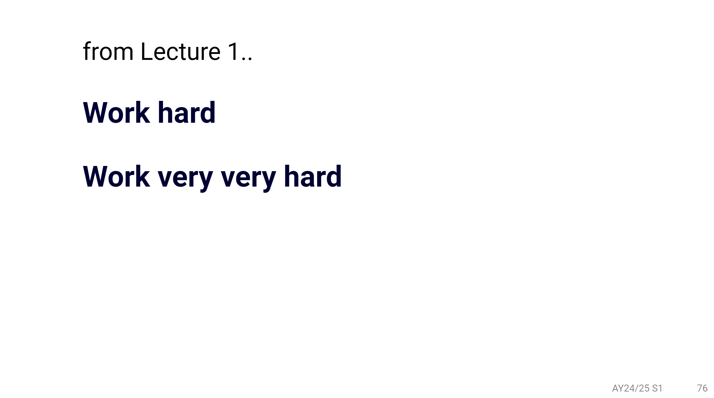

I still can remember that from midterms onward, there’s been at least one test every week, and in the second-to-last week, there was at least one test every single day. It feels as if I’ve been transported back to the intense days of preparing for my *GaoKao*. But unlike those days, first of all, this time, I’m living in the C BLK of Temasek Hall at NUS — a Hall known for its athletic spirit, but is also a warm, close-knit "family" collectively nurtured by all **Cblings**!

# Temasek Hall (TH)
For me, as an Internationsl Student, living in Temasek Hall is my second experience of Singapore’s hall culture. However, this time, it’s different — or more precisely speaking, considerably different. 

Honestly speaking, I feel that my being able to join Temasek Hall is nothing but a "miracle". When I was applying for accommodation, I had already heard from my senior that in NUS, the "best" living environments are at PGP and Utown. Halls, on the other hand, were often described as noisy and less ideal (at least based on the information my senior shared with me). So, I chose three houses at PGP and included all my CCAs in the application (I wasn’t sure if it would help HAHAHA, but I just wanted to increase to chance to get into the houses). 

Yet, when the results were released on July 5th, I found myself assigned to Temasek Hall, which was a Hall! At that moment, I felt a bit disappointed, worried that the environment wouldn’t allow me to focus on my studies. Still, I consoled myself with the thought of having a single room instead of a double room. Even worse at that time, when I found out I was assigned to C Blk, my senior told me that it’s the noisiest block because it’s closest to the Comm Hall and usually people from A and B Blks passed through. Hearing this, I felt even more frustrated.

However, now, everything has turned around entirely. After spending a whole semester in this "warm Cblings Cupermarket", I couldn’t be more grateful that I wasn’t assigned to PGP. I’ve discovered that not only was my initial perception about TH completely wrong, but everything here is absolutely amazing and warm! And it all began with THOC - where the dream starts!

## THOC
THOC stands for Temasek Hall Orientation Camp, which is the largest activiy in Temasek Hall. Honestly speaking, this has been the most thrilling Orientation Camp I’ve ever attended. I can still vividly recall the unforgettable activities I participated in during OC. For instance, on the final half-day, my friends and I were blindfolded and took part in a series of exciting activities. It was absolutely exhilarating! On top of that, I can’t forget the countless strange questions asked by the "Changed voice" aunties and uncles, HAHAHAHA!

The most touching part was the final night of THOC. That evening, my friends and I were blindfolded and led to the open rooftop. When we removed the blindfolds we had been wearing for half a day, the first thing we saw was a breathtaking sight — that was the candles prepared for each of us by the seniors. It was such a moving moment! Then, our Block Head Yu Cheng delivered an impassioned speech that I still remember vividly. He reflected on the past few days and, more importantly, said, *"I know the past few days have been an unforgettable experience for each of you, but don’t forget, your uni life just begins! I hope each of your journey will be even more unforgettable. And remember, Temasek Hall will always be your home!"*

  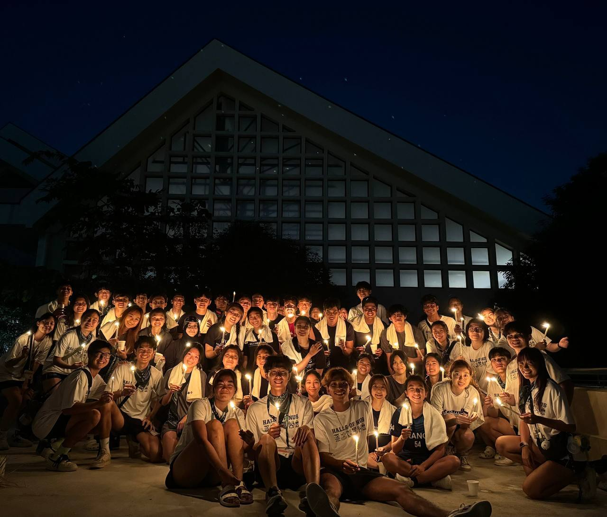

Still immersed in the moving speech, we were guided, with candles in our hand, to the Common Hall. In front of me stood two lines of people forming a human corridor that I had to walk through to reach the end. Along the way, my candle would be blown out by someone, only to be reignited by another person nearby. At the time, I just thought it was a fun activity, HAHAHA. But now, I feel like I’ve started to understand the thoughtful design behind it. 

  <video style="width: 100%;" controls muted>
    <source src="../images/posts/NUS-CEG-Y1S1-Recap/THOC_Video.mp4" type="video/mp4">
  </video>

The lit candle seemed to represent our hope. Walking through the human corridor symbolized our uni life. Those who blew out our candles represented the challenges we encounter, each trying to extinguish our hope. Yet, there were always others around us, ready to use their candles to relight ours, reigniting our hope. And when we finally reached the end of the corridor, having completed this journey, we earned the right and had the obligation to help others — to relight the candles of those still making their way forward, helping them reignite their hope.

  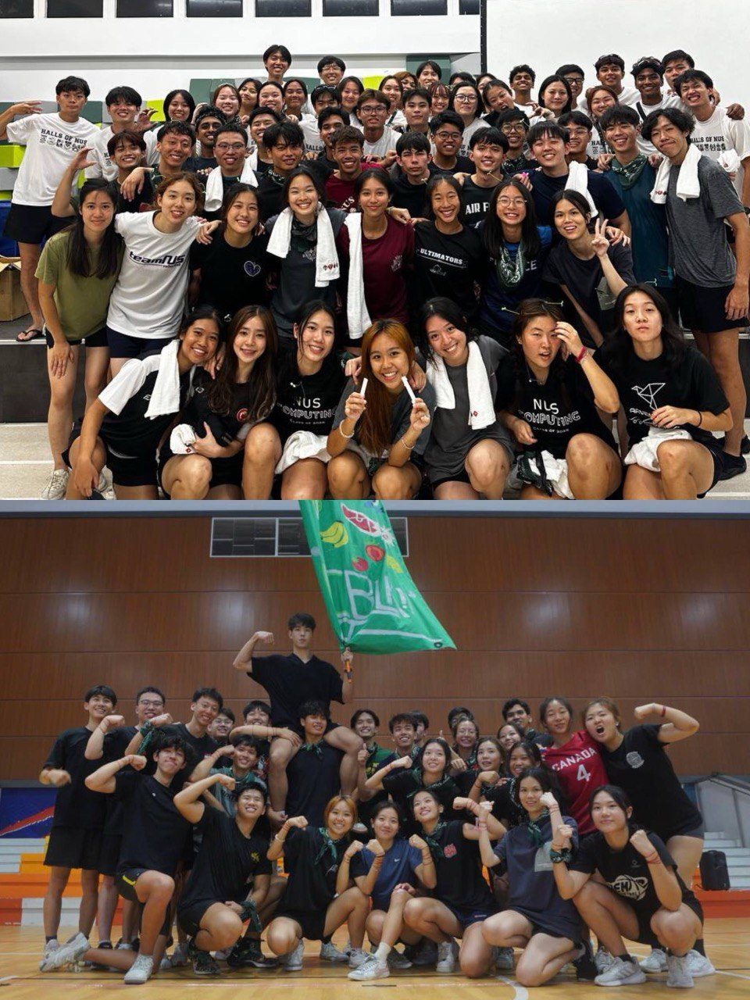

## AnM
Besides THOC, another event that left a deep impression on me was *Angel and Mortal*, organized by our C BLK Comm. Here, I want to once again thank my angel, Minh Anh, and my mortal, Gwentella (nickname: darling. That's why I was called "darling angel" HAHAHA). I’m so grateful to my angel for all the welfare packs, heartfelt notes, and the final gift—they truly helped me get through a challenging period of study. I also want to thank my darling Gwentella for the many delightful inverse-welfare surprises and the moving letter at the end! I’m incredibly thankful to both of them. 

During the final revelation, I was deeply moved. Seeing so many people stand up for me and "justice for WENBO" was soooo heartwarming. Honestly, I wasn’t too concerned about the final outcome, but I was sooo moved by the love and support from all the lovely Cblings! Lastly, I’m legit grateful to the Block Comm and Block Head for taking the time to recheck everything, which gave me the opportunity to share the title of AY24/25 C BLK’s Best Angel with Xin Wei!

Looking back on this AnM journey, two moments stand out to me the most. Firstly, I finally got the chance to make up for last year's AnM regret in NTU Hall 12 by designing a website to challenge my darling(mortal) this time. Using the website as a platform, I was able to bring some of my small ideas to life — essentially it's just a simple "give-back gratitude" idea. I tried to channel the blessings I’ve received from the locals and pay them back through this small activity. I know there were many areas where I could have done better, so I’m especially grateful for my darling, Gwentella, for her understanding and patience!

  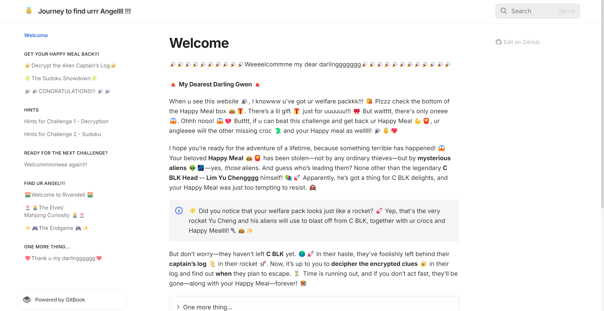

Secondly, it is something I didn’t expect but discovered as I reflected on this AnM journey with my darling. Let me explain it in detail. The website I designed is about the theme *"Find your Happy Meal and find your Angel"*. Since one of AnM’s goals is to help us get through the challenging midterm period, I realized that this theme applies perfectly to my uni life as well! 

In uni life, we may face countless moments of difficulty and stress. But through AnM, I’ve learned that even when life hits you hard, there are always "Happy Meals and Angels" around you. So, no matter how tough the challenges are, don’t let them defeat you. Take a moment to observe the people and things around you, and you’ll discover that your life is filled with tons of "Happy Meals & Angels" and they are all the blessings!

## Other Activities
In addition to these two activities, I also participated in many other fun and team-building events organized by the C BLK Comm throughout this sem, such as the BLKOut, welfare events, and fire warden. So, I legit legit want to thank all the cute C BLK Comms for organizing so many wonderful activities this sem. I also legit appreciate your warm invitation for me, an IS, to join in — HAHAHAHAHA!

  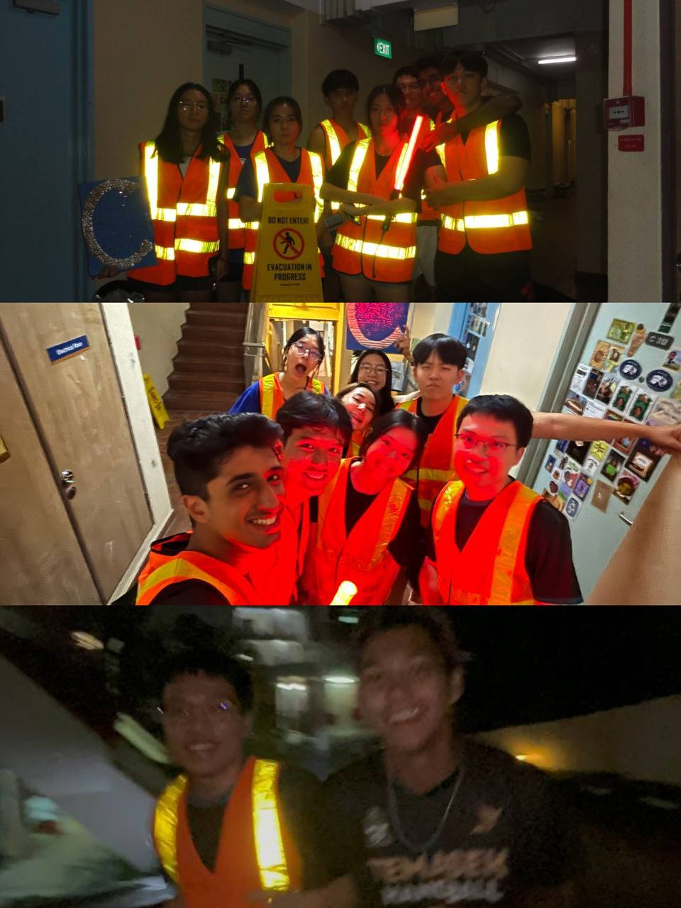

As an IS in Temasek Hall, I genuinely want to thank everyone here because this place has legit let me feel a sense of inclusiveness and warmth. Even though I’m far from home, the people and the environment here have made me feel like I’m living in another "HOME", just as Temasek Hall’s slogan says, *"Some call it a hostel, we call it a HOME!"*.  Here, I’ve gained many solid friendships, and **I’ll never forget the dinners we’ve shared, the games we’ve played, and the laughter we’ve experienced together as Cblings**. I love my HOME, and I love all the Cblings! 

Although I don’t know how much longer I’ll be staying here, from the nervousness at the start of the semester to the contentment now, this journey has taught me that some things are beyond my own judgment because my perspective is so limited. And perhaps, the best way to face such moments is to trust in that everything is part of the best plan. 

Anyway, I don’t know if this will be my *LYLC*, but I’ll always treasure these beautiful memories forever!

  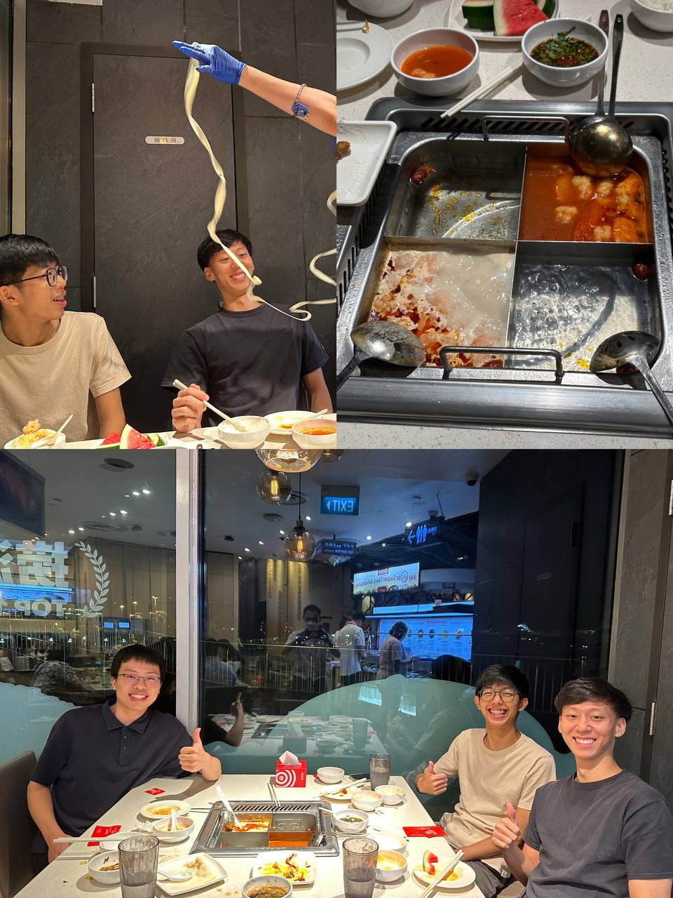

# Courses
Now, after talking about the Hall Life here, I inevitably have to return to studying, as that is the main purpose of my being here. As mentioned at the beginning, this sem's study has not been easy for me, even though I already have a year of experience. Please allow me to share some of the insights and reflections I’ve gained from my studies in this sem.

## CS1010
CS1010 (Programming Methodology) is legit a course that has shocked me! For someone like me with no competitive programming experience, this course is legit incredibly difficult. I still can’t forget how, before every PE (Practical Examination), I always thought I was well-prepared, only to feel like my confidence was completely destroyed after each PE (😭)! It was really, really frustrating. But what I’m truly grateful for is that this unique experience and feeling has given me a whole new perspective on certain things.

  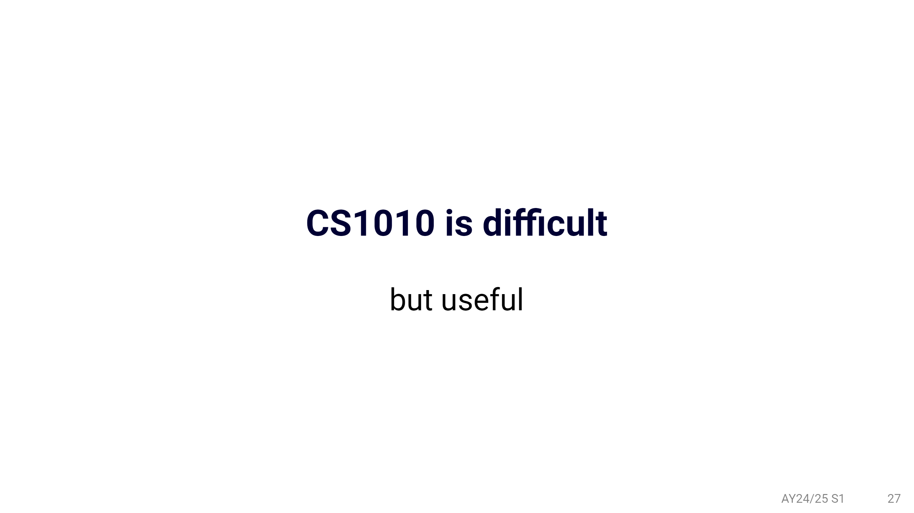

First, a very practical lesson I learned is that *coding is never something that can be mastered "in one go"*, especially practical coding, as opposed to theoretical tests. This is very different from the science education I had before. In many cases, practical coding is not just about theoretical derivations. It’s more about testing your proficiency. Only after you’ve practiced enough and gained a solid understanding of the algorithms and data structures required for certain problems can you quickly solve them within a limited time frame. That’s why I still remember what Prof. Ooi said in class, *"Don’t stop your hand doing the ‘dirty’ work!"* It’s such a useful piece of advice! Train your programming mindset every day, even if it’s just solving one problem.

Secondly, what I found particularly impactful was one of the three pieces of advice Prof. Ooi shared with us in the first lecture of CS1010: *"Grade is not everything. Focus on: learning new skills, leveling up your skills, and enriching your experience."* Although this course has brought many challenges and pressures throughout the sem to me, it wasn’t until the last lecture, when Prof. Ooi recapped CS1010 with us, that I realized how many "Nostalgic Moments" I had experienced. I discovered that I had [learned so much](https://wenbo-notes.gitbook.io/cs1010-notes/lec-tut-lab-exes/lecture/lec-12-recap) throughout this sem! The emphasis for this word of advice lies in the second part — **what we should focus on is not the grade itself, but the progress and growth we experience during the learning process**! This has been incredibly useful and inspiring for me!

  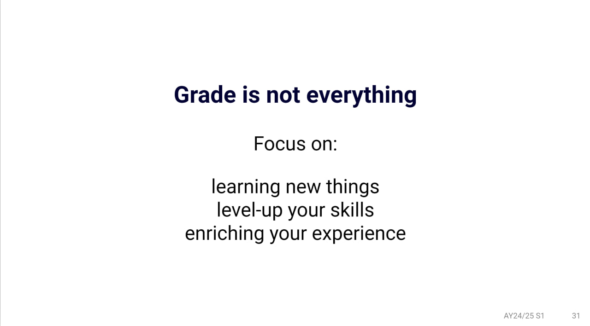

Lastly, I would like to once again thank every Prof and my TA of CS1010, as well as my dear "battle buddies" (classmates HAHAHA). Thank you for your patient guidance throughout the sem. Every time I attended the lecs/tuts/labs, I felt I gained a fresh perspective and valuable insights. This feeling is legit wonderful!

  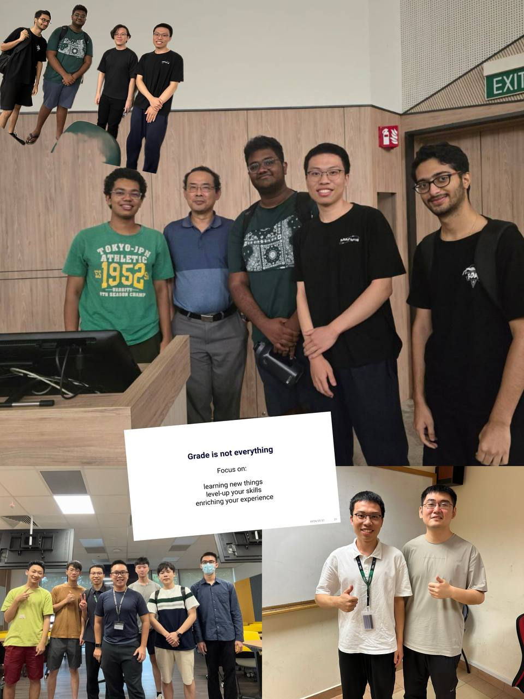

## CG1111A
CG1111A (Engineering Principles and Practice I) is another course that has legit surprised me! I didn’t expect it to be so enriching and useful! From the basic principles of circuit analysis to the fundamentals of analog circuits - Op-Amps and the final project the utilises all what we have learnd to build an "a-maze-running robot", the course content has been laid out in such a gradual and structured manner. At the same time, these topics have aligned perfectly with my future interest - chip design! How amazing it is!

  <video width="250" controls>
    <source src="../images/posts/NUS-CEG-Y1S1-Recap/CG1111A_Video.mp4" type="video/mp4">
  </video>

Besides the course content, what left the deepest impression on me in this course was my Prof Khoa, my TA Yijian, Telfer, and Lim, as well as my CEG classmates in the same lab. The warmest moment in this course came during the last class, after each group completed the Final Maze Running, Prof Khoa bought bubble tea for everyone! As I sipped the bubble tea and looked at the robot I had built with my teammates, a sense of deep gratitude and emotion filled my heart. In this course, I not only gained a lot of professional knowledge but also forged many friendships and experienced warmth. How moving it was! So much so that during the final group photo, I genuinely felt that we, along with the Prof, TAs, and Lab Manager, were one "big family" — **growing together, helping each other, and learning from one another**!

  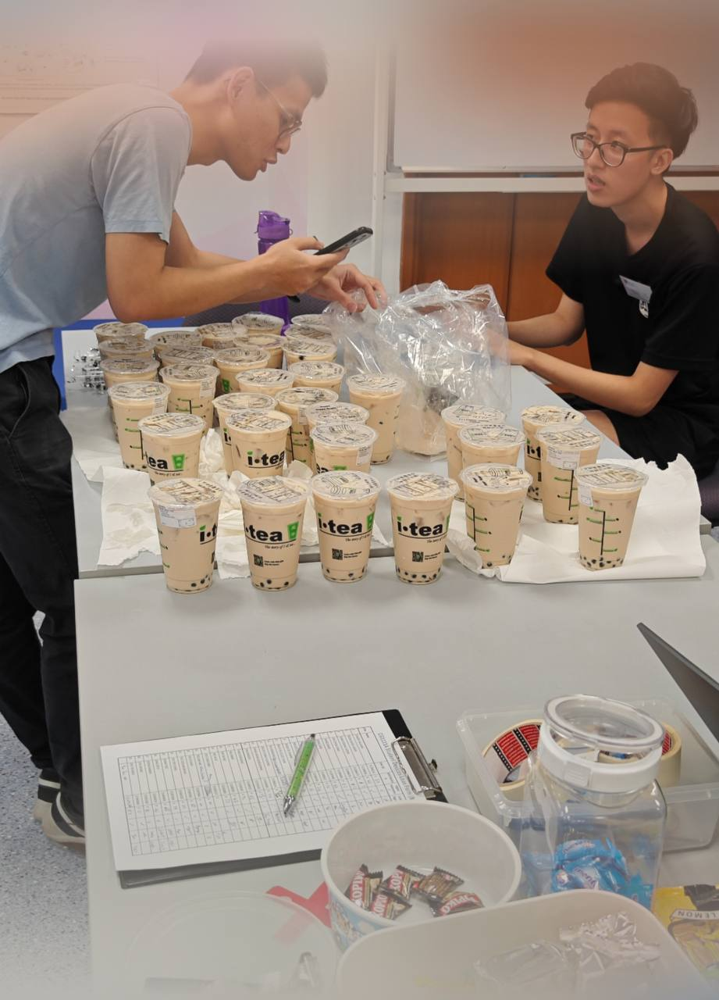

Therefore, in conclusion, I would like to sincerely thank the Prof, every TA, Lab Manager, and my classmates in CG1111A. Thank you for making this course incredibly warm and awesome! I wonder, one year from now, if I’ll recall this beautiful morning when we all enjoyed the bubble tea together, chatting and laughing with one another. *"Nostalgic, legit Nostalgic!"*

  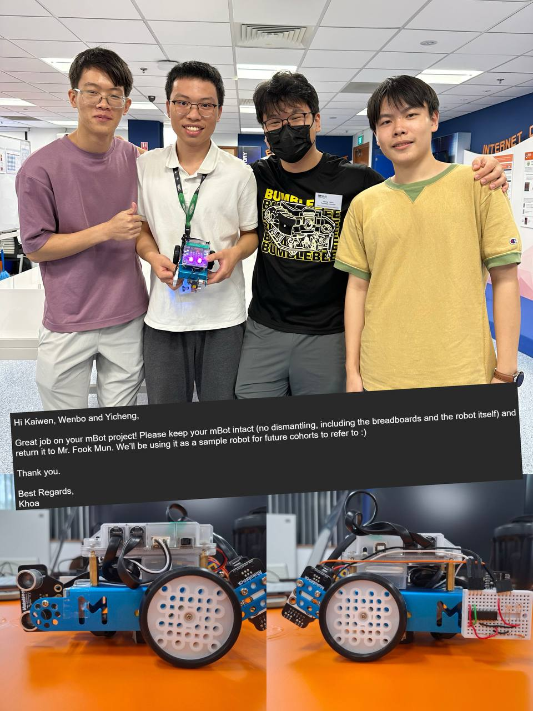

## Other Courses
Besides CS1010 and CG1111A, the other courses I have taken in this sem are also very warm and awesome! As a token of gratitude, I have included detailed information in my [lecture notes](https://github.com/mendax1234/lecture-notes) to help any CEG junior or anyone studying these courses. I hope my notes will be helpful to you!

Even now, I still vividly remember the words of our Dean during the SOC welcome speech on the afternoon of August 1, 2024: *"Recalibrate yourself because you are in NUS SoC now."* This sentence left a deep impression on me and constantly reminded me that there were many geniuses around me. Truthfully, I don’t consider myself one of those exceptionally brilliant geniuses. Instead, I’ve come to realize that this understanding, as I mentioned in [CS1010](#cs1010), has encouraged me to focus on *learning new things, leveling-up my skills, and enriching my experience* — rather than solely focusing on my GPA.  

Beyond that, this recognition of my own "limitations" is not about self-deprecation or an attitude of passive life-style. To me, it represents a sense of contentment and trust that comes from deeply understanding that *"Your grace is sufficient for me."* All the wisdom I possess is precisely what suits me best. If I had more, I might become arrogant; if I had less, I might feel lost and inadequate. So, what I have now is exactly enough. That's legit one thing I should be very grateful for!

In short, everything happens is the best plan! Speaking of this, it reminds me that the opportunity to study at NUS itself is a profound blessing! Looking back now, my studying journey feels nothing but a miracle. First and foremost, I want to express my gratitude to every Prof and classmate I had at NTU. Without the academic foundation I built there and the various challenges I overcame during my year 1 at NTU, I don’t think I would have been able to adapt and thrive as quickly in the new environment of NUS CEG in this first semester. 

Interestingly enough, I realized that the knowledge I gained during my first year at NTU seemed almost tailor-made to prepare me for what I would encounter this semester at NUS. For example, in NTU, the mathematics course only covered the first half of James Stewart’s *Calculus*. At that time, I was eagerly looking forward to studying the second half, whcih is the multivariable calculus. But due to my course structure, I never got the chance. Then, upon arriving at NUS, I discovered that the Prof here assumed we already knew the basics of calculus (that's precisely what I learned at NTU) and immediately dove into the multivariable calculus. That's amazing!

And this once again proves that *everything happens is the best plan*!

# Epilogue
At this point, this recap seems to be coming to an end, which also means that a semester of life and study is coming to a close. Looking back on this past semester, the shifts in my mindset, the changes in my thoughts and my actions, have all brought a profound sense of growth to my heart. In summary, what I’ve come to realize is that around you, there are countless "Happy Meals & Angels," representing so many things to be grateful for. So, don’t let life’s pressures weigh you down — pause often, and discover the "little blessings" around you. It is through gratitude that you will find the strength to keep moving forward! 🌟

Anyway, what’s truly worth celebrating is that I will soon be reunited with my family after four months apart (😭). How time flies! It feels like just yesterday I was saying goodbye to my parents at the airport, and now, tomorrow, I will be meeting them there again! I think for me, the saddest moment is at the airport, when I have to say goodbye to my family, but the most exciting moment is also at the airport, because that's the place where I get to reunite with my long-missed family! It's only when you've lost something important that you realize how wonderful it is to have it, and how much it is worth being grateful for having it!

Perhaps, this is one of the insights that studying abroad has brought me: only after being away from home for a while do you truly realize the beauty and warmth of having a home. No matter where you go, your "root" will always be in your homeland. East, West, HOME is the best!

Once again, I would say this page is too short for me to include everything in. Even if I had thousands of pages, I could never finish writing about all the grace and love I have experienced. But anyway, may all gratitude be transformed into action!

Here, I sincerely wish everyone a happy holiday and a Happy New Year in advance! 🎉

  Dec 3rd 2024, National University of Singapore, Kent Ridge Campus

> Thank you so much for spending your precious time reading my "nonsense"😂, you have read around 3000 words! That's super awesome!
