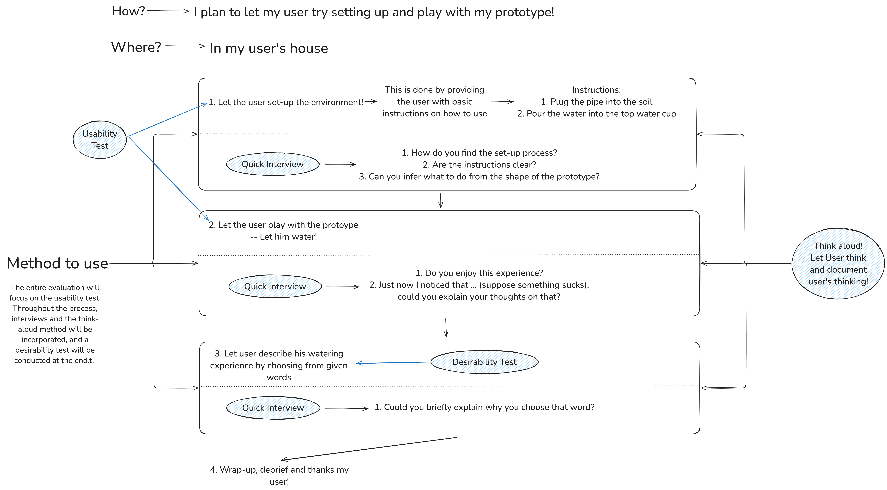

> Try new things, try crazy things. Throw the convention out of the window.

I still vividly remember a quote that left a profound impact on me during my final year of middle school. It came from the iconic Apple commercial released in 1997, titled ["Think Different."](https://www.youtube.com/watch?v=5sMBhDv4sik) The ad went:

> "Only those people who are crazy enough to think they can change the world, are the ones who do."

  

Back then, I was deeply inspired by this message. Think Different wasn't just a slogan to me, it was a call to dream bigger. Especially after reading Steve Jobs' biography, my admiration only grew. Jobs had brought to life so many revolutionary products that truly changed the world 🌍. I, at that time, at around 15, too, longed to build something that could make a difference.

However, that dream was temporarily shelved as I became immersed in the demands of schoolwork. It wasn't until my first year at NUS, when I enrolled in **DTK1234: Design Thinking**, that the spark reignited. Through this course, I gradually reconnected with that earlier passion -- for innovation, for challenging the norm, and for believing that bold ideas can change the world.

# Discovery Phase
As the course began, I was so surprised to discover that one of the three main topics for the semester was centered around plants -- one of my absolute favorites! 🌱 What a wonderful coincidence that felt almost too perfect to be true. With that excitement in mind, I dove into the first few Individual Learning Activities (ILAs), only to realize that they weren't as easy as I had hoped. Still, I'm grateful for those initial challenges, because within those ILAs, I started to uncover little sparks of curiosity and delight. And there were so many fascinating and unexpected insights hidden in the process!

## Norman Door
This was the preparation of my Design Thinking journey in DTK1234. Although this was just an introductory segment, and many of my peers said it wasn't directly connected to the rest of the course, I personally found it deeply impactful. In this segment, we are asked to explore the concept of the Norman Door -- which may be a poorly designed door that confuses users about whether to push or pull. It may seem like a small concept, but for me, it was a revelation. It opened my eyes to how deeply design affects our everyday experiences, often in ways I don't even realize.

By exploring the "Norman Doors", which are designs with **poorly perceived affordances** that confuse users about how to operate them, in my daily life, I discovered that **feedback mechanisms** and **principles of visibility** are key to designs with well-perceived affordances. For example, I chose Tesla's car door handle as my "Norman Door". It has a decent feedback mechanism, which means I can relatively easily find the correct opening method by pressing different positions, but it does not seem to follow the principle of visibility well since I could not immediately figure out how to use it when I first saw it.

  

From my experience, why was I unfamiliar with the Tesla handle's operation? I think a significant reason was my habit of using traditional car handles -- those hollow, outward-pulling designs. So, when faced with a completely new design, I felt disoriented. This raises an intriguing question: is it because we're constrained by traditional ways of thinking so that we perceive certain objects as having "poorly perceived affordances"? If so, this leads to an interesting conclusion: **not every "Norman door" is a "bad design."**

  

Some designs that seem to be "Norman doors" may, in fact, represent the direction of future innovation. A great example is Apple's first iPhone, the world's first touchscreen phone. Before the iPhone was released, people were accustomed to phones without touchscreens, relying solely on physical buttons, like BlackBerry devices. So, when the first iPhone launched, many found it unfamiliar and might have even considered it a "bad design." However, the first iPhone undeniably set the standard for smartphone development from its debut to the present -- and likely for the future -- because the original iPhone seamlessly connected a new way of interacting with phones (the new function) through the touchscreen (the new form). On the other hand, for simpler products like traditional doors and faucets, if they lack basic perceived affordances -- meaning they fail to change the traditional mode of operation but instead add unnecessary complexity to existing designs, which leads to "poorly perceived affordance." In such cases, these designs can genuinely be considered failures, as they overcomplicate functionality without adding real value.

In my experience, when viewed from a different perspective, Tesla's embedded door handle design actually connects a new way of opening car doors (the new function) with the hidden handle (the new form). One of the advantages of this approach is that it cleverly leverages aerodynamics to enhance vehicle performance. Additionally, many Chinese car companies, such as BYD, Xiaomi, etc, have followed Tesla's lead and adopted this hidden handle design. So, perhaps such designs represent the trends of the future?

  

Finally, this experience has taught me an important lesson: when designing a product, strive to adhere to the principles of visibility and feedback. However, don't be limited by traditional constraints. Dare to think outside the box -- what you design might just become the trend of the future? Thus, a new mindset formed in my brain: **"Try new things, try crazy things." Throw convention out of the window and explore ideas I wouldn't normally dare to try**. This thinking laid the foundation for my entire Design Thinking Journey. With this mindset, I felt excited to tackle the case ahead of me!

This discovery shook me -- in the best way possible. Even before diving into the core of design thinking, I was already feeling that spark of innovation again. The Norman Door reminded me that meaningful design starts with being observant, questioning the norm, and reimagining the ordinary.

## Systematic Creativity
From this segment onward, I seem to step into my Design Thinking Journey. The main goal of this part was to train our creativity -- or more precisely, our creative thinking. Some people might be naturally creative, but I believe creativity isn't something you're simply born with. It can be cultivated through practice and intentional effort. Why? Because creativity, at least the way I understand it, doesn't always mean inventing something entirely new out of thin air. Sometimes, creativity means combining existing functions in new ways, or improving on what already exists. Both involve creating something out of nothing, but the first relies purely on imagination with no external reference, which feels a bit unrealistic to me. The second, on the other hand, acknowledges the value of building upon existing ideas -- and I find that much more grounded.

That said, I have to admit this segment gave me a really hard time at first. I felt completely lost. I was struggling with two things: 1) The topic of plants was just too broad. There were too many directions to explore, such as watering, sunlight, soil, fertilization... it was overwhelming. 2) I didn't initially understand that this activity was more about **"quantity over quality"**. We weren't expected to come up with perfect solutions, just lots of them would suffice.

  

Looking back, I now realize the true purpose of this segment was to train the fundamentals of creative thinking. More specifically, it introduced methods that could be incredibly helpful in developing creative ideas, like the **5-step iteration process**. One moment that really stood out to me was when I used the **"making a shift"** technique to improve my original idea for controlling how much sunlight a plant receives. At first, I thought about using a special kind of glass that could regulate light reflection. But that would require advanced knowledge in materials science and physics, and probably wasn't practical. Then I had a breakthrough. I remembered the robotic vacuum cleaners. Then I thought, why not give the plant wheels? In that way, it could simply move to find the sunlight it needs.

  

This "making a shift" technique didn't just help me in DTK1234. It also inspired an idea I ended up using in another module, PF1101. And when I tried to optimize my ideas using the 5-step iteration method, I realized that this was exactly what creative thinking looks like in action.

## Empathy
This segment marked the true beginning of my Design Thinking Journey. For the first time, I felt like I was no longer just exploring design principles. Instead, I was applying them in a way that felt real and personal. The main purpose of this part, in my view, was to clearly define the problem I wanted to solve. And in doing so, it also addressed the first source of confusion I had in the previous segment. I realized that narrowing down the scope of the problem allowed me to focus more effectively on designing meaningful solutions. It was a turning point.

One part of the process that really stood out to me was the practice of **asking "why"** repeatedly during the user interview to uncover the root cause of a problem. For example, by continuously asking "why" when talking to my interviewee, I found that the surface-level reason for overwatering plants was a lack of knowledge about how much water was appropriate. But as I dug deeper, I discovered a more fundamental reason: the user was afraid that if they didn't water enough, the plant might die.

This moment completely shifted the way I saw the problem. It not only helped me understand their behavior more deeply, but also revealed aspects of their personality. Those insights allowed me to tailor my solutions more effectively.

   
  <em style="font-size: 0.9em;">Figure: Key insights derived from the user interview process</em>

Looking back, I've come to see this ILA as far more than just an interview. It was a process of insight discovery -- powered by the simple act of asking "why". And as I'll share in the next part, this very skill became one of the most valuable tools I used throughout the rest of the course.

# Development Phase
To be honest, up until this point, I still wasn't very confident in my own design thinking. I think it was because I hadn't come up with a truly "crazy" or groundbreaking idea yet. That made me doubt whether I was doing it right. But looking back now, I feel grateful -- because all the work I had done during the Discovery Phase laid a solid foundation for what came next. When I started thinking about possible solutions, I could genuinely feel myself using **systematic** thinking to structure my ideas and approach the problem with clarity.

One thing that really helped streamline this process was applying the "Jobs to Be Done" (JTBD) framework. I realized that JTBD could guide my thinking in a very natural and organized way, helping me stay focused on the user's true needs. Here's the JTBD diagram I created:

   
  <em style="font-size: 0.9em;">Figure: Use JTBD and knowledge learned from Intro ILA to ILA 2 to come up with a crazy idea</em>

For me, this round of idea generation was a legit Eureka moment. It was the first time I felt a genuine sense of excitement and ownership over an idea I wanted to pursue. That moment gave me not just a direction, but also the motivation to start turning my idea into reality.

## Prototype
"Prototype" is a word that I heard countless times back in high school during my FRC robotics competitions. Back then, for me, prototyping meant actively making physical components to test the ideas out, because the gap between simulation and reality is often wider than we think, and most of the time, that gap can't be bridged through theory alone. I found that this segment of the course worked in mostly the same way.

During my prototyping process, I encountered two major challenges: 1) The efficiency of the watering pipe, and, 2) The overall stability of the system. What truly excited me was that **the power of asking why** came to the rescue once again! For example, when building the water tank, I asked myself:
1. "Why is the device unstable?" -> Because the center of gravity is too high.
2. "Why is the center of gravity so high?" -> Because the tank holds too much water.
3. "Why does it hold too much water?" -> Because the tank itself is too large.

By identifying the real root cause, which is an oversized tank, I improved the prototype by switching to a smaller one, and the result was immediately better. It was a simple fix, but it showed how much value lies in thoughtful questioning, which is to continuously ask "why".

Besides this example, I also noticed that some basic knowledge of physics and math could be incredibly helpful in this stage -- for instance, when analyzing the system's center of gravity.

Overall, I genuinely love prototyping. Whether it was back in FRC or now in DTK1234, I've always found joy in the process of turning crazy ideas into something real. There's something incredibly rewarding about watching an idea take physical form, even if it's imperfect. That feeling of progress is legit unforgettable!

  <video style="width: 100%;" controls>
    <source src="../images/posts/NUS-DTK1234-DTJ/prototype.mp4" type="video/mp4">
  </video>

## Evaluation
And then came the final segment: evaluating my actual solution. Surprisingly, as I got closer to completing this journey, it felt like I had come full circle -- back to where it all started, with the "Norman Door". I found myself asking the question that's very familiar to me again: *How do I prevent my design from becoming a Norman Door?*

During the evaluation phase, I realized something important: understanding whether a system has clear and well-perceived affordances isn't something that prototyping alone can reveal. As a designer, I'm often so focused on solving problems that I may unconsciously overlook usability issues. For instance, I placed three water pipes in a triangular layout, assuming it would be intuitive because it looked stable and made logical sense to me. But during user testing, I was surprised to find that the user didn't understand it at all. That moment was a wake-up call -- it showed me just how different a user's perspective can be from the designer's intent. It's like passing an idea through a long pipe: what comes out the other end may not be what you expected. There's always some distortion, some loss in translation between what you design and how it's perceived.

   
  <em style="font-size: 0.9em;">Figure: My Evaluation Test WorkFlow</em>

That's why evaluation is so powerful. It helps close the gap between what I want to create and what the user actually experiences. Through testing, feedback, and iteration, I refined my solution to offer clearer affordances -- and in doing so, I brought my entire Design Thinking Journey to a thoughtful and meaningful close.

# Summary
Overall, one quote from the lecture that deeply resonated with me was:

> "Design Thinking is a creative approach to solve problems or enhance existing solutions."

 As I completed this Design Thinking Journey, I realized that for me, the greatest joy in design thinking lies in discovering the connections between different segments and applying the various skills I learned to different scenarios, thereby better using creative thinking to solve practical problems. I think design thinking represents a big closed loop where each part is closely connected to the others. When I found myself returning to where my journey began after completing the final phase, I felt incredibly excited! This design thinking journey may have been challenging, but I firmly believe that the skills and knowledge I gained will serve me for a lifetime!

And now, looking back to that quote from the Apple "Think Different" campaign:

> "Only those who are crazy enough to think they can change the world, are the ones who do."

I'd like to add my own reflection, so now it becomes:

> Only those who are crazy enough to think they can change the world and **actually try to make it happen** are the ones who do.

Because dreaming is important, but daring to act is what makes a difference.

> Try new things. Try crazy things. Throw the convention out of the window and **truly make your idea come true**!

## Some Interesting Points
This part I legit legit want to give bigs thanks to Matt! It was, without exaggeration, a legit meaningful and eye-opening discussion! I legit learned a lot from him! Below are some very interesting points I want to talk more about

### 1. From functional to beautiful
During both the prototyping and evaluation phases, my primary focus was on improving the functionality of my design，which is to make sure it embodied the two qualities of good design that were mentioned in the intro segment:

1. A well-designed feedback mechanism
2. Adherence to the principle of visibility

However, after Matt's reminding, I realized that I am not the end-user of this product. If I want more people to use -- or even love -- my design, it had better also be **visually appealing**. Functionality alone is not enough. That's when I start to see:

> The iteration process is not just as a way to refine what the product does (functional), but how it looks and feels (beautiful).

For instance, could the water tank at the top of my system be shaped like a flower? 🌸 Could the pipes be redesigned to spiral elegantly around the plant’s stem rather than just standing upright? These small aesthetic changes may seem minor, but they can make a product go from functional to beautiful -- and perhaps more importantly, from useful to desirable. I am so impressed by Matt's idea!

### 2. Real-World Problems are not just Functional, they can be Human-Centered too!
One of the most important takeaways from my Design Thinking Journey is the realization that identifying the right problem to solve is essential. That’s absolutely true. In many of my own experiences, these problems were **closely tied to functionality**. For example, something wasn’t working efficiently, or something could be optimized. However, after Matt's reminding, I realized that in the real world, not all problems come from functionality issues. In fact, many arise from **people's subjective experiences and perspectives**, which are what we often call **human-centered problems**.

For example, the idea we discussed in the intro segment:

> "Not every Norman door is truly a Norman door, and this is because sometimes, it’s the user’s convention that creates the confusion."

This really struck me at first. But if we think carefully about it, the core of this idea is that **humans are subjective creatures**, thus the conventions we create and follow may also be subjective.

For instance, the Tesla door handle may seem intuitive to someone who drives a Tesla regularly， but may be completely confusing to someone who has never used one. **What feels natural or obvious is often shaped by personal experience and expectation, not just objective design flaws**.

So, till now, the skills I have learned in DTK and those in other courses, seem that can be used to solve the problems related to functionality at most of the time. However, faced with those **human-centered problems**, are these skills still applicable and effective?

In fact, if we think in depth, **problems don’t exist in a vacuum**.  Instead, they’re always about **people**. Whether we’re engineers or not, we are ultimately solving human problems. That means people -- with all the emotions, experiences, and biases -- are the **subject** of our problems, not just the **audience**. And because people are subjective creatures, the problems we are about to solve are **human-centered** at most of the time.

### 3. The most creative people are often the most empathetic ones
Throughout my Design Thinking Journey, I mainly applied creative thinking to improve the **functionality of my product** -- and while that is certainly important. After Matt's reminding, I’ve come to believe that **truly creative people are often the most empathetic ones.**

But I think this is true **only** in engineering and other practical disciplines. After all, what is the ultimate goal of engineering? It's to solve problems -- but more specifically, human problems. That means, when designing creative solutions, we can’t afford to ignore the emotional and psychological dimensions of those we are designing for. We must understand people deeply, including the hidden reasons behind their behaviors and frustrations. In other words, creativity and empathy are inseparable.

Matt shared a particularly eye-opening example that helped me understand this. Imagine someone designs a toilet brush that works really well in theory. It can effectively clean the toilet. That's great! But then, why do we still encounter dirty toilets? Clearly, the problem isn’t entirely technical. Instead, it lies on the **human level**. It's because some users may say, “I don’t want to use a toilet brush because it brings my hands too close to the toilet bowl.” Others might say, “I injured my hand and can’t use the brush properly.” These seemingly simple comments reveal a deeper insight: the obstacle isn’t the brush’s effectiveness, but people’s willingness and ability to use it.

So, the real design challenge becomes: "Can we create a system that keeps toilets clean without requiring users to physically handle the brush at all?"

This example beautifully echoes the point I made earlier: in the real world, most problems are not purely functional -- they’re human-centered. That’s why, in reality, the most creative people aren’t just inventive; they are empathetic also. They see through the surface of a problem to understand its roots, which is often buried in human behavior, emotion, or need.

### 4. How the DTK course shapes your daily life?
This profound question was posed by the legend -- Matt. But for now, I choose to leave it unanswered. I believe it's one of those questions that deserves to sit with you, to grow with time, and to quietly shape your life without you even realizing it.

That said, one example is that he mentioned a student who, before taking DTK, would often jump to offer solutions even before fully listening to someone’s problem. But after going through the DTK course, that same student learned to pause, listen patiently, and only then respond thoughtfully.

This subtle shift reflects a deeper change -- not just in how we approach design, but in how we relate to people. And perhaps, that is what design thinking is ultimately about: **not just affect the way we solve problems, but affect the way we live our daily life**.

## Follow-up
As Prof. Boyd once said in CS2030S,

> Without **YOU**, this course would not be so wonderful like what it is!"

So, I want to say a big, heartfelt thank you. To
1. **My Prof Atiqa** --  Thank you so much for your patient guidance during every ILA, and for all the fun, engaging activities in each TBW session. Without your support, I don’t think I could’ve learned so much and grown this much.
2. **Every DTK teacher** --  thanks so much for all the effort you put into the videos and the materials! I can feel it, legit can!
3. **All my classmates from TE23** --  Yall's company made every moment in DTK so enjoyable. And yall made this journey so special for me!
4. **My legend Mr. Matt** -- thank you so much for your very very and legit encouraging email at the start of this sem as well as the legit legit insightful discussion at the end of this sem! It legit gives me much much enery through the journey of this course.