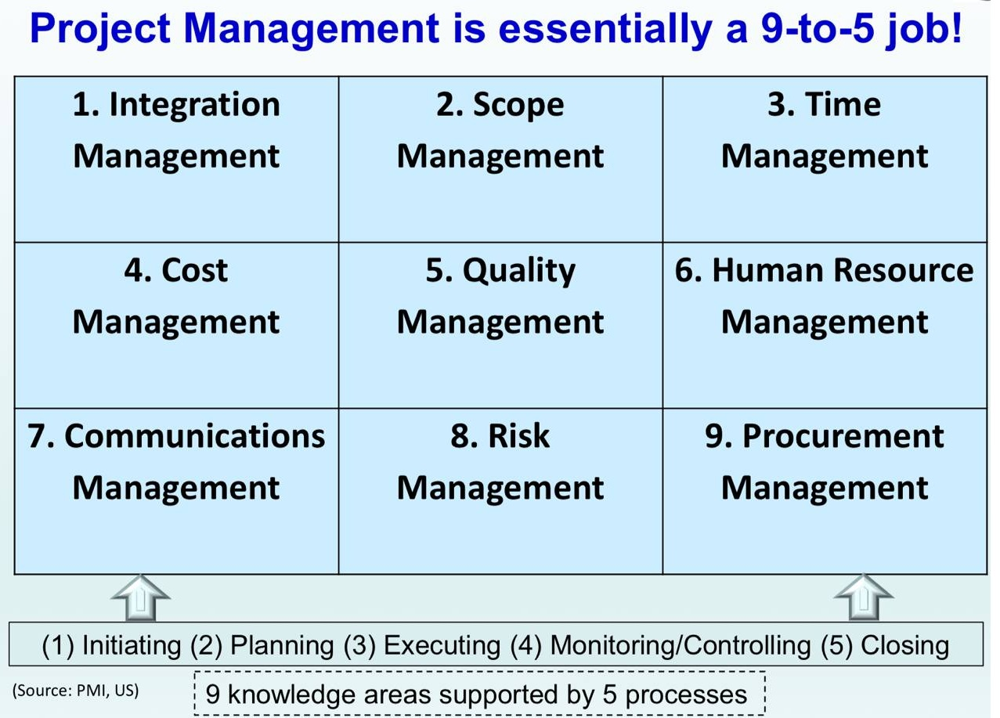
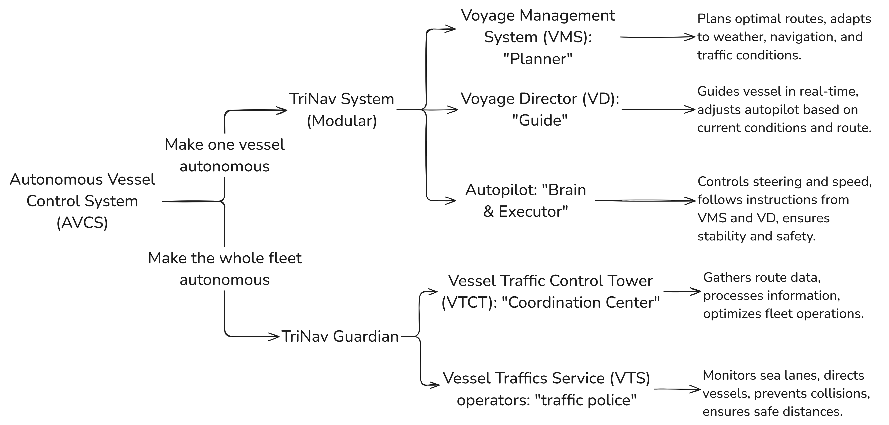
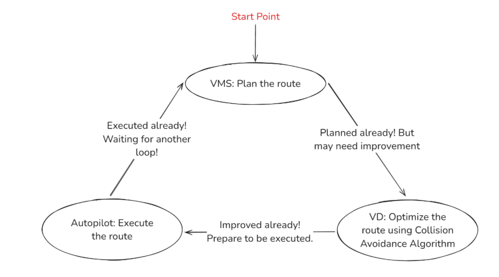
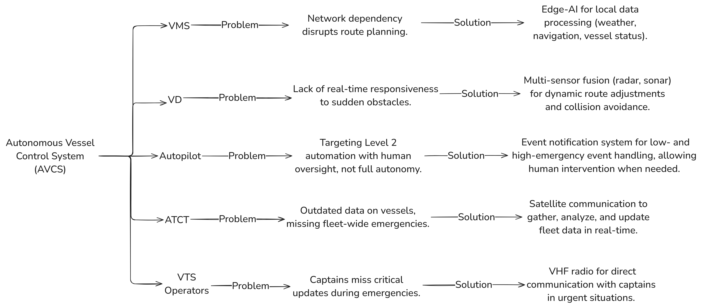

# The Beginning
Before the semester even began, I had already heard from seniors that PF1101 was an easy SU course, that is something you could just cruise through and forget about, because, after all, "it has nothing to do with your major, right?" But is that really true? I don't think so.

In this course, my group and I chose the sea transport industry as the focus of our utilitarian project. And to be honest, I had absolutely no idea what I was doing at first :joy:. I still remember how lost I felt in the beginning. When Professor Low introduced the nine areas of project management, I couldn't help but wonder how on earth we were supposed to apply all of them to our own group project. I had a vague idea about building an autonomous vessel control system, but no clue on how to make that vision real. Faced with such a complex challenge, where was I even supposed to start? During our first tutorial, our group had a few scattered ideas -- someone mentioned using an edge-AI chip — but we were far from forming a coherent plan. It was like staring at an empty sea, not knowing where the ship should sail.

   
  <em style="font-size: 0.9em;">Figure: PM is a 9 to 5 Job!</em>

But looking back now, I'm truly grateful that I realized what we were missing at the time was a solid, comprehensive solution. This solid solution would become the foundation of our entire project, shaping the key components of project management like the work breakdown structure, the list of activities, and the project life cycle, etc. And these elements, I later understood, were not just important, but were absolutely essential to the success of any project.

I still remember one of the tutorial videos that showed how a house is built -- from laying the foundation to completing the structure. Every step was deeply connected, forming a living, breathing system. That moment struck me. Our project was no different. We couldn't treat each part in isolation; we needed a solution that was systematic, grounded, and thought through from the start. Only with that kind of clarity could we begin to manage the project effectively.

But the question remained: 

> How do I go about building a system that is not only complete and solid, but even a little bit crazy -- just crazy enough to spark the energy, the drive, and the passion we'd need to carry the entire project through the long journey of project management?

# Where Magic begins
If I had to pick one highlight from this course, it would be the moment I designed what I truly believe was a justifiable, innovative solution. But looking back, what I'm even more thankful for is the process that led me there -- a process that gently nudged me toward thinking creatively, toward building something entirely new. And in many ways, that mindset was something I had first started cultivating adn training in DTK1234.

## Understand the context
I came to realize that designing a meaningful solution begins with **understanding the context**, which in our case is

> why autonomous vessels?

In the real world, sea transport is favored for its large capacity and low cost, but there's a catch -- voyages often last for months. And if a captain has to manually control the vessel the entire time, the mental and physical demands are overwhelming. As we dug deeper into our project, we discovered that fatigue is one of the leading causes of maritime collisions. That sparked a question in my mind: 

> How can we reduce the captain's workload and lower the risk of accidents?

The answer became clear — automation. This understanding became the backbone of our belief in the value of autonomous vessels. It also reminded me of something vital: you have to understand the "why" before working on the "how". That's what being utilitarian really means to me, which is not just solving problems, but solving them in a way that is practical, meaningful, and truly useful. After all, at the end of the day, the solution we're designing isn't just for us -- it's for our users. Or in other words, it's for our clients.

## Understand the gaps
The next step was to **understand the gaps**. In other words, why aren't autonomous vessels already common today? Through our research, we identified two major barriers:

1. The lack of stable internet at sea makes real-time updates to routes difficult. 
2. The low adoption rate of both collision-avoidance algorithms and the necessary sensors.

But why was it important to uncover these difficulties? I came to see this as a process of narrowing the problem space. By identifying and isolating the key gaps, we were able to apply a "divide and conquer" approach, breaking the larger challenge into manageable parts and systematically solving each one to ultimately construct a complete, cohesive system. This will make our solution more focused, targeted, and coherent.

This process of narrowing down was personally transformative for me. Whenever I face a complex, unfamiliar system, I tend to feel overwhelmed — as if I need to solve everything all at once. But this course taught me that I don't have to. I just need to solve one small problem at a time, and over time, those small victories can be accumulated in some way into something much bigger.

Real-world projects are like this too. Each project touches on a vast and complicated domain. That's one of the reasons I felt lost when choosing a topic in the beginning -- everything felt too big. But now I've learned that the key is to first define what exactly you're trying to solve (**divide**), then focus on tackling those subproblems one by one (**conquer**), and finally, to synthesize these partial solutions into a complete, integrated system (**combine**). It's this structured, focused, and iterative mindset that I now carry with me, not just in PF1101, but in how I approach complex challenges in general.

## Understand the existing and similar projects
The next step was to look outward, which is to **study existing projects and explore whether there was anything we could learn from them**. As Newton once said, "If I have seen further, it is by standing on the shoulders of giants.” I was reminded of a moment during our very first lecture, when we discussed the uniqueness of projects. Even though each project is unique, there is still so much to learn from past experiences. Armed with the context I had explored in Step 1, and the gaps I identified in Step 2, I began to look for inspiration beyond maritime transport -- and that's when it hits me: the Aviation Industry.

I've always been an aviation enthusiast. Every time I board a plane, I find myself in awe of the precision, the complexity, and the sheer brilliance of modern aircraft. And this time, from that fascination, I saw a clear connection, which is a parallel between aviation and autonomous sea transport.

1. Just like captains, pilots face the risk of fatigue.
2. Aircraft, like vessels, often operate in environments with poor or no internet connectivity.
3. Both industries must deal with collision risks. And yet, aviation has become one of the safest and most automated modes of transport in the world (Barnett & Reig Torra, 2024).

That led me to the central question that would shape our entire project:

> Could we learn from aviation to build a better solution for maritime automation?

It was in this step that everything I had done so far, from understanding the context to identifying the core problems, finally came together. These earlier insights helped me narrow the scope of where we looked for inspiration. And what I discovered was nothing short of magical: so many ideas in the real world connect and echo each other in unexpected ways. Once you truly understand the problem you're solving, and the environment you're solving it in, you open the door to discovering inspiration across domains.

And to my delight, even something as simple as "I love flying" turned out to be meaningful. It became a bridge, linking my personal passions with my academic work. That small detail from everyday life ended up shaping the direction of my entire project. And for that, I am truly grateful.

## Design the solid solution
Finally, I came to the most exciting part, which is **designing our solution**. This is where the insights from aviation helped me "make the shift", which is a term from design thinking that means applying inspiration we got from the existing projects into a new context. Armed with this mindset, I studied how planes achieve safety and automation and found two key components:

1. **How one airplane flies safely**: This is mostly thanks to the Flight Control System (FCS), where the Flight Director, Flight Management System, and Autopilot work seamlessly together. 
2. **How many airplanes fly safely**: This is thanks to the efficient Air Traffic Control towers that coordinate multiple flights and prevent collisions.

Inspired by these insights, I designed our own Autonomous Vessel Control System (AVCS).

   
  <em style="font-size: 0.9em;">Figure: My AVCS Design</em>

And within our Autonomous Vessel Control System (AVCS), the TriNav System operates through a tightly integrated closed-loop mechanism involving three core components. 

   
  <em style="font-size: 0.9em;">Figure: The closed-loop workflow for VMS</em>

Alongside the TriNav Guardian, both systems are designed to address real-world maritime challenges, which mainly are based on the gaps we have found in the above step. These challenges and how each AVCS component contributes to solving them are detailed in the following image.

   
  <em style="font-size: 0.9em;">Figure: The problems that AVCS solves</em>

Step by step, we turned scattered ideas into a structured, systematic, and practical solution. And after designing our solution, I found myself genuinely excited about the rest of the project management process. I wanted to bring this idea to life, not just in theory, but in practice. This experience helped me realise how every part of the journey -- from understanding the context, to identifying the gaps, to learning from existing projects, and finally designing our own solution -- was deeply connected. Each step built upon the last, like links in a strong, unbreakable chain. This way of thinking also showed me how creative thinking and project management can come together in powerful ways. It's not just about planning, but it's about vision, structure, and bringing something meaningful into the world.

# Summary
I think this Eureka moment is what made project management so exciting to me. From initiating to planning, navigating through ambiguity sparked my growing interest, as it felt like I was solving real-world problems that could genuinely make a positive impact on people's lives. However, as I moved from planning into the final stages -- executing, monitoring, and closing -- I noticed a gap between planning and execution. It reminded me of the common gap between vision and reality: "How well would our AVCS actually perform in the real world?” That's still unknown. More testing would be needed, especially the tests we couldn't conduct ourselves, but could still account for in our project's planning. Even this taught me something important: project management isn't just about action, it's also about preparation for the unknown.

All in all, I truly loved this PF1101 experience. From a small spark of an idea to a solid, structured solution, and then using the five project management processes -- initiating, planning, executing, monitoring, and closing -- to analyse and refine both the whole system and each of its parts. This journey helped me transform my initial confusion into an interest in project management, which
also made me fall in love with project management. To me, this experience of project management was a miniature of real-world projects and a magnified lens on the small projects in my studies. On a more personal level, it helped me see how I can apply the same mindset to
other areas of my life and studies. I genuinely believe that the lessons I've learned from this course, especially the way each project management process is interconnected -- from understanding the context and identifying the gaps to drawing inspiration from existing projects to design our our solutions -- will stay with me for a long time. I'm confident that I'll continue to carry these insights with me throughout my journey as a computer engineer.

---

So, in the end, would I say this course is useless for engineers?

> Absolutely not.

For me, this course was far from useless. In fact, it was surprisingly fun to discover something meaningful and exciting in a module I initially thought would be irrelevant to my major. More importantly, I've come to see that there's an indispensable connection between PF1101 and all the other courses I've taken at NUS.

> But how exactly does it connect?

Well ... I'll save that for my next blog post, which will be a reflection on my CEG Y1S2 journey. Stay tuned!

  Jun 22nd 2025, Rouen, Normandy, France

