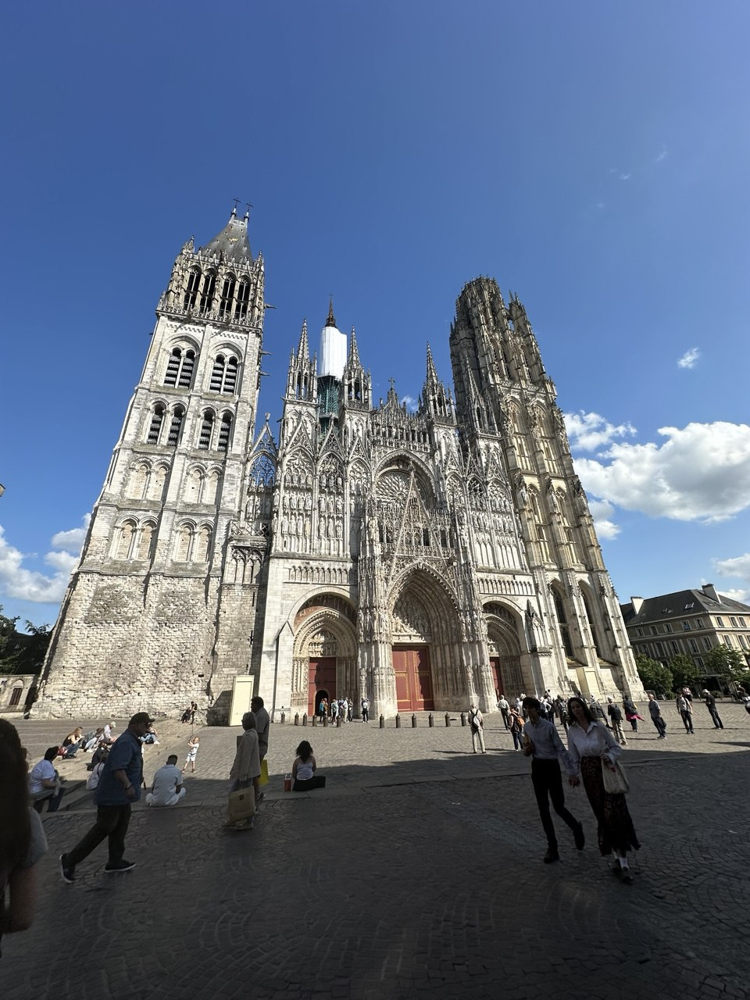
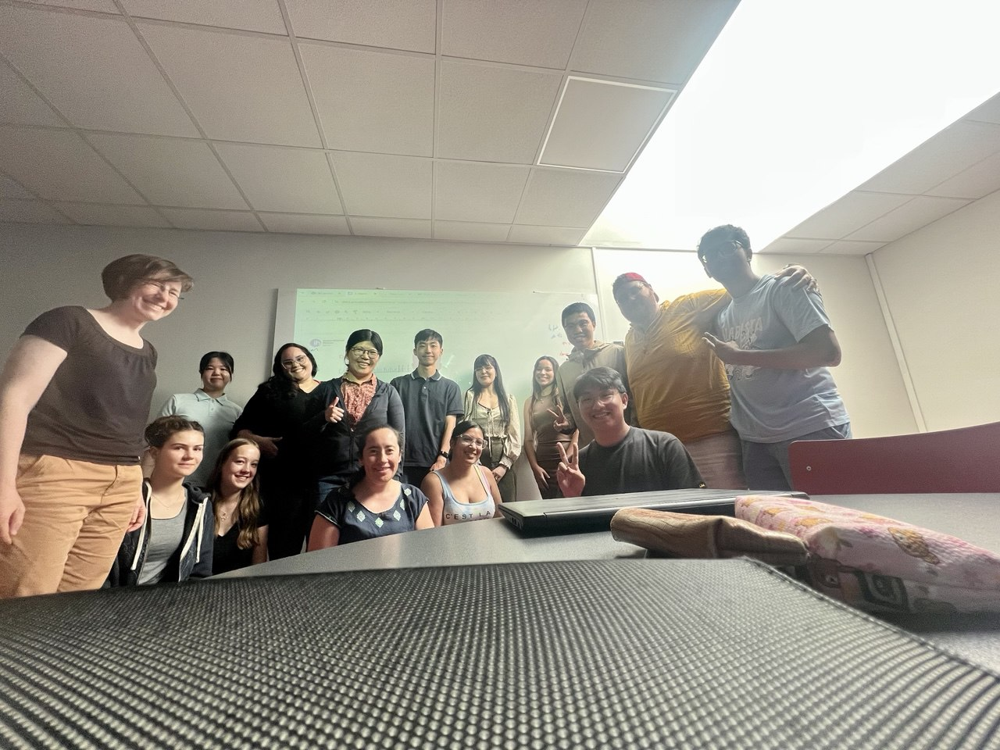
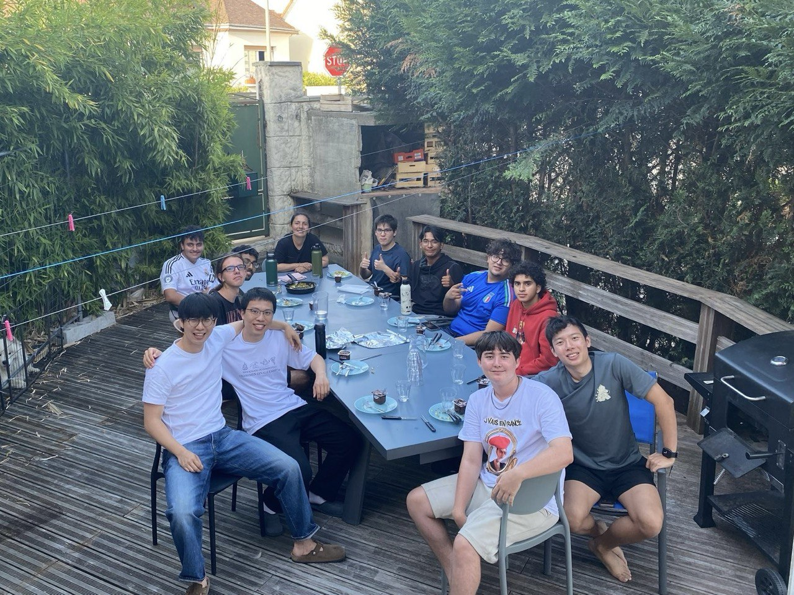

> Le temps file!

This was a phrase our French teacher once introduced in class. She often brought it up right before the end of each lesson -- because, truly, time always seemed to fly by so quickly. And now, in my final week here, I finally feel the full weight of the Weber–Fechner law: the last few days have passed in the blink of an eye. And looking back, this entire month seems to have vanished just as swiftly.

# Arriving in Rouen
I still clearly remember how I felt when I first arrived in Rouen—uneasy, and a little anxious. After all, it was my very first time setting foot in Europe, all by myself. I had come to a place nearly ten thousand kilometers away from home -- a place entirely unfamiliar. I had no idea how I would manage in a foreign country, surrounded by a language I barely understood. I didn’t know what challenges I would face. I truly didn’t know.

   
  <em style="font-size: 0.9em;">Figure: Rouen Cathedrale</em>

Carrying these feelings with me, I still remember that at start I just wanting this month to pass quickly. Life here felt incredibly inconvenient at first. Not only did I have to navigate the challenges within my host family, but I also had to keep up with daily reviews and reinforcement of the French lessons. During that first week, I felt utterly drained—both physically and emotionally.

## Learning at Rouen
Looking back now, I realize that the true highlight of this month-long journey was studying at French in Normandy. Above all, I feel incredibly lucky to have shared my classes with almost the same group of classmates throughout the month. Although the teachers changed each week, my classmates remained largely the same -- and for that, I’m truly grateful.

Our group was beautifully diverse, with students from all over the world. The chances of us meeting in any other context would have been so slim, yet here we were, all brought together in Rouen this June by a shared goal: to learn French. I’m genuinely happy to have met each and every one of them.

And I won’t forget hiking through Étretat with my Japanese classmate, the open-hearted conversations we had every Wednesday afternoon's *Discutez* with people from different corners of the globe, or the countless little presentations we tackled together in class with randomly assigned partners. Each moment stays with me and resonates with me!

   
  <em style="font-size: 0.9em;">Figure: My classmates!</em>

At first, I couldn’t understand why we had a different teacher every week. I thought it would be better to have one teacher guide us through the whole month. But in the end, it was this rotation that made me feel especially grateful during the final week, when I was reunited with Azza, who had also taught us in the second week.

I truly want to thank all the teachers who guided me during my time here: Fahameh in the first week, Azza in the second and last, and Thomas in the third. I’ll never forget their patience in answering my questions and the encouragement they gave me along the way. Every time I read the personal message each teacher wrote at the end of the week, I could feel just how joyful and rewarding learning French can be.

I also want to thank my fellow NUS classmates who came here to study French with me. I’m truly grateful for this opportunity to grow closer as friends, and I sincerely hope we’ll have the chance to explore France together again someday.

## Living at Rouen
When it comes to my stay in Rouen, I think my feelings can be summed up in one simple truth:

> In a foreign land, if I have a place to lay my head and enough to eat, I should be grateful. And even if not, I should still be grateful.

This past month, I lived in what was perhaps the most challenging environment I’ve ever experienced, but I still feel deeply thankful. Not only because I had a roof over my head and enough food to eat, but also because I was surrounded by classmates from all around the world. We shared conversations, helped one another, and lived under the same roof as a small global community. These moments of connection, of mutual support, of shared laughter over dinner are what I’m truly grateful for.

   
  <em style="font-size: 0.9em;">Figure: Friends living together</em>

# Farewell Rouen
As I come to the end of this month-long journey learning French in Rouen, I realize that it has been nothing short of incredible. At the beginning, I was filled with fear, even the urge to run away. But by the end, all I feel is gratitude. And that transformation is nothing but magical.

To all my friends and teachers: I legit look forward to crossing paths with you again someday. Thanks for meeting!

**Au revoir!**

  Jun 29th 2025, Paris Charles de Gaulle Airport, Paris, France

