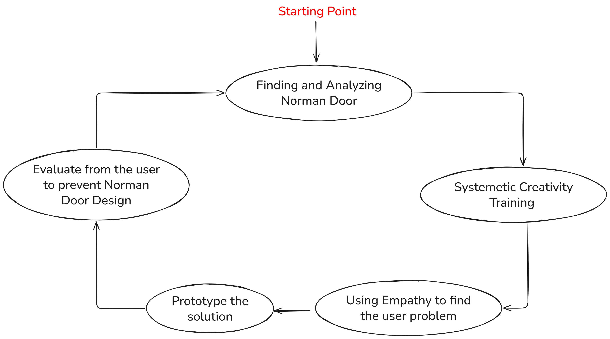
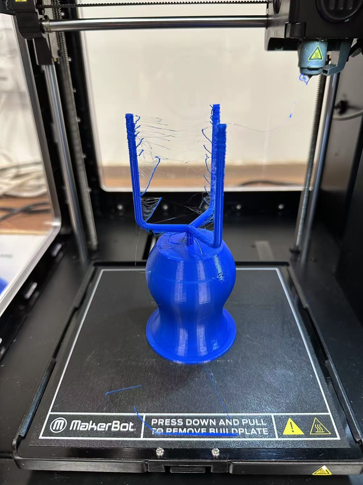
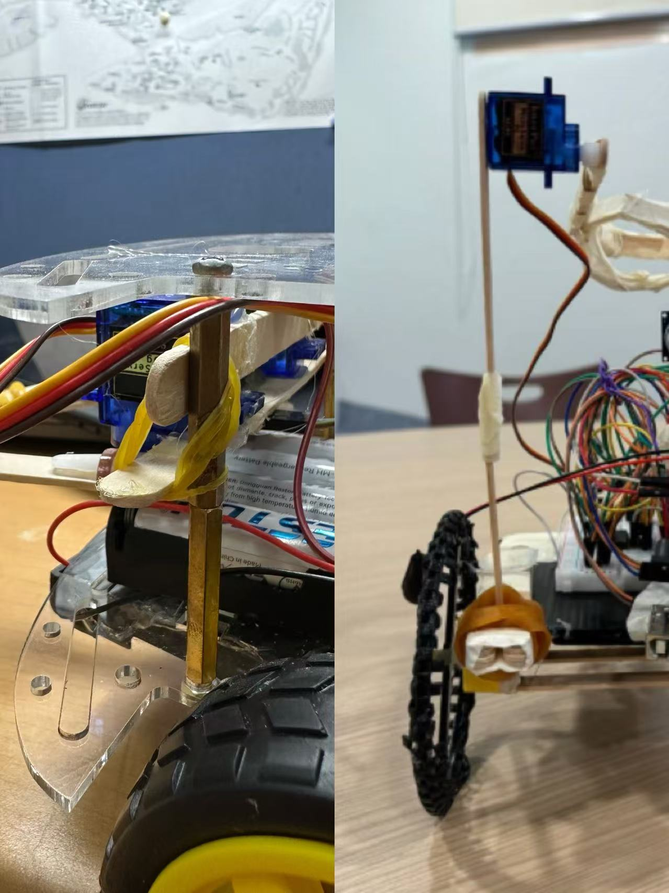
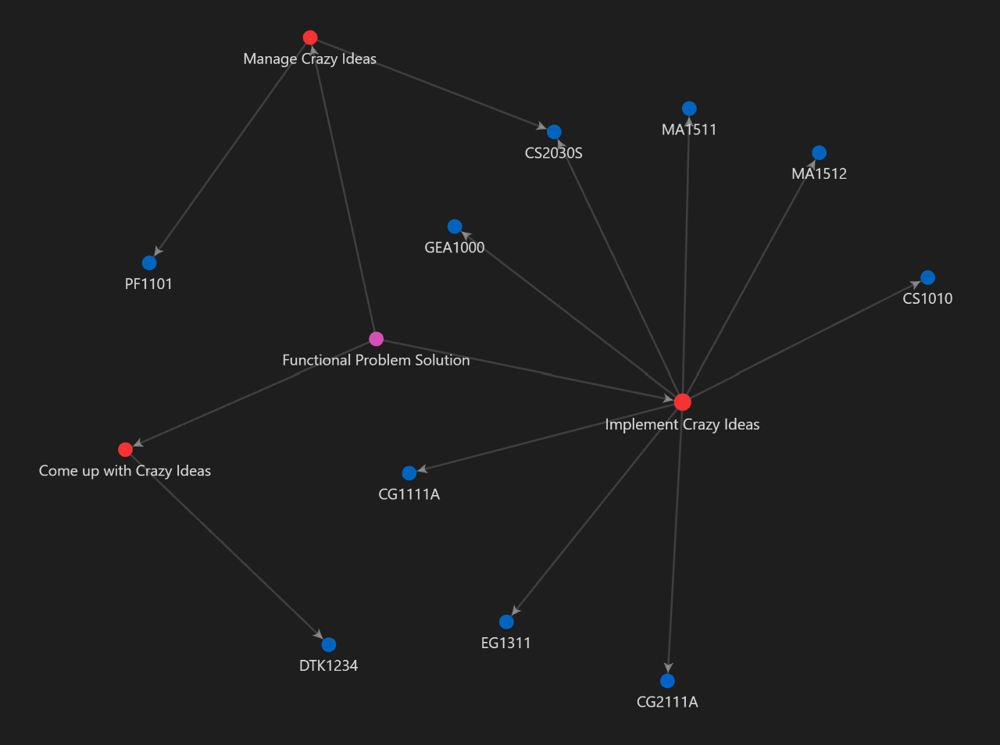



> Try new things, try crazy things. Throw the convention out of the window.

Just as I wrote at the beginning of my DTK1234 DTJ blog, there's truly no better sentence to sum up my Y1S2 than this one above.  I still remember that during the winter vacation after Y1S1, I discussed with my CS1010 tutor, a very capable senior from the mathematics department, about which courses were good in our school. And during the discussion, I found that the senior agreed with one of my viewpoints, which was,

> Universities should not be confined by prescribed curricula or specialized courses. Instead, students should take more classes that interest them and are of exceptionally high quality within the university.

I think this is also one of the main reasons why I chose to take CS2030S with the CS students in Y1S2. However, this statement seems to add another layer of meaning to university life, which is to **experience the high-quality courses available in the university**. I admit that this is not wrong, but in fact, what I'm grateful for is that in Y1S2, I discovered an even more **amazing** perspective...

If in Y1S1, what impressed me the most was the wonderful and warm hall life as well as the highly demanding professional courses, then in the just-passed Y1S2, what I consider the highlight is having obtained or discovered a set of framework on how to systematically design and implement an innovative solution when facing complex real-world problems. Such a framework is not rigid and fixed but will be improved step by step as I take more courses, just like gradually increasing my skillset.

To put it simply, what I found most amazing, exciting and thrilling when building this framework was discovering the **connections** between various things. Here, "things" mainly refer to the courses I have taken, but can also include everything that has happened in my life, such as my hobbies and observations of nature. I think it is precisely because of the diversity of these "things" that I feel the ingenuity of these connections, to the extent that I would describe them as "elegant". These connections interweave with each other, seemingly forming a large network diagram, and this network diagram seems to be an important part of the skillset that I have gradually built up during my college life, or perhaps even throughout my growth process.

So, in short, apart from experiencing the high-quality courses at school, I am very grateful to have discovered that in my college life, I should also explore the connections between different things. This not only enables me to constantly enrich my skillset and improve this problem-solving framework, but also helps me to always keep a grateful heart, grateful for discovering such a wonderful world!

# Build such a framework

Many people would say that the common courses at NUS are boring or useless. However, in my opinion, every common course I have encountered so far seems to be closely linked. So when I find myself in one course, I can apply the knowledge I have learned in other courses, which makes me very excited and thrilled. But I think the most important thing is that it makes me see that every event I encounter in my life seems to be carefully arranged. Although I don't know the reason why it happens to me at the time, many times, it is precisely the time that tests my faith and obedience. Because after experiencing the event, I always seem to discover what I have learned from it, whether it is knowledge growth or spiritual growth. In short, I believe that the arrival of every event has a beautiful purpose!

So, what exactly is this framework that I consider closely connected? To put it simply, I think the foundation of this framework is from coming up with crazy ideas to implementing the crazy ideas and then managing the crazy ideas in teams. It's not hard to notice that each part of this framework's foundation revolves around "crazy ideas". And when it comes to crazy ideas, the first thing that comes to my mind is a common course this semester -- DTK1234. Therefore, I would like to start with this course to talk about the first step in building this framework's foundation -- how to come up with crazy ideas.

## Come up with crazy ideas

I have detailedly recorded my mental journey in the DTK1234 course on my [DTK Blog](https://mendax1234.github.io/NUS-DTK1234-DTJ/). To put it simply, the most important thing that DTK1234 has taught me is "how to come up with crazy ideas". I still remember using the 5 iteration steps in class to constantly improve my idea, and constantly asking "why" to discover the root cause of the problem, etc. In short, in this course, I not only needed to come up with a crazy idea, but also needed to simply implement this idea, and finally needed to get feedback from users to improve my final product. I think this is actually a microcosm of the case when I need to solve a more complex real-world problem.

   
  <em style="font-size: 0.9em;">Figure: DTK1234's rough loop to solve a practical problem</em>

In my other common course PF1101, there is a statement about the uniqueness of the project, which says:

>  Every project is unique. But uniqueness and similarity are not binary opposites. We can still draw inspiration from similar projects to complete our own project.

I think that since DTK1234 serves as a microcosm for solving real-life problems, its significance does not lie in our copying a certain idea or solution. More importantly, what we should learn is  the approach to solving problems. For instance, the loop for solving problems I mentioned in the first paragraph can be regarded as an approach to problem-solving. Because each problem is unique, but certain problem-solving approaches can still be applied. This is why we say,

> Give a man a fish, and you feed him for a day; teach a man to fish, and you feed him for a lifetime. （In Chinese, it is called “授人以鱼，不如授人以渔”）

What I want to say is that DTK1234 is a very comprehensive course that trains and applies creative thinking to solve practical problems in real life. If we look at it from a higher perspective (the huge and complex problems in real life), I think the most important point that DTK1234 trains me is to come up with a crazy idea with creative thinking. This idea is very important, and its novelty largely determines the quality of the solution (for more details, please refer to my [PF1101 blog](https://mendax1234.github.io/NUS-PF1101/)). However, it must be admitted that crazy and great ideas are often not achieved at once. They still need to go through continuous iterations to grow into truly great ideas. And coming up with crazy ideas is only the first step in this framework.

## Implement crazy ideas

The proposal of "Crazy Ideas" is indeed important, but it only remains at the stage of "fantasy". Therefore, turning the idea into reality is an indispensable part of this framework. It is worth being grateful that I find that in the implementation, the accumulation of various professional and technical knowledge is largely required. Thus, all the technical courses I have learned come in handy!

A simple example is that when I have an idea to enhance the laundry experience for Hall users, to realize this idea, I might need to create an app. To create an app, I need to master programming skills. These programming skills are what I learned in CS1010 and CS2030S. Or, when I have an idea in the engineering discipline and want to make a device, I will find that I need basic mathematical modeling thinking and knowledge of physics to conduct theoretical feasibility analysis. Besides, I might also need to know 3D modeling skills so that I can turn my idea into reality through 3D printing. Such examples are everywhere in my life. In a word, I think it is to make me see the importance of these technical courses because these technical skills are actually enriching my skillset step by step, and I have to use this skillset to solve most of the practical problems in my life.

   
  <em style="font-size: 0.9em;">Figure: DTK1234's product with 3D printing</em>

However, it is worth mentioning that I have discovered that these individual areas of expertise are not isolated from each other. In other words, every course I have taken, including both techinical and common courses, is not isolated. This relationship is not hard to find among courses with prerequisites. However, I have also experienced this wonderful connection between common courses and specialized courses! For instance, in the common course EG1311 on robotics, I personally experienced that devices fixed with rubber bands instead of hot glue are more stable and reusable. In my technical course CG2111A on robotics, my team and I ingeniously applied this idea to our robot named Alexandra! Another typical example is that in CS1010, I learned to use the Divide and Conquer method to solve complex programming problems through recursion. When facing a large project in my DTK1234 and PF1101 courses, I also attempted to apply this idea! There are many more such examples.

   
  <em style="font-size: 0.9em;">Figure: Same inspirations but used in two courses!</em>

In a nutshell, this is precisely one of those "elegant" connections I mentioned at the beginning of the article, namely, the connections among techinical knowledge from different aspects that exist in techinical courses! And I think, this may serve as another spark to learn more techical courses bah. 😂

## Manage crazy ideas

A product born from implementing crazy ideas not only requires the initial implementation but also long-term maintenance. This maintenance is no longer something that can be effectively handled by an individual but rather demands a team. Just as I learned in CS2030S,

> The software I write needs to have high maintainability and scalability/extensibility.

At the same time, just as Prof. Boyd told us in the last lecture of CS2030S, 

> Always code as if the guy who ends up maintaining your code will be a violent psychopath who knows where you live
>  
 -- John Woods

Being a "responsible" coder and writing software that is highly maintainable and scalable is undoubtedly an individual way to manage crazy ideas. However, in this semester's courses, there is one that is directly related to management, which is PF1101 -- Fundamentals of Project Management.

I have elaborated on how legendary this course was in another blog of mine. However, in a nutshell, I think the most significant meaning of this course is that it taught me how to effectively manage a team and a large-scale project in real life, which is from initiating, to planning, to executing, to monitoring/controlling, and finally to closing. I believe this course has filled in the last piece of the puzzle for me!

> PF1101 is another compulsory common course in my major. And doesn't it better illustrate that not all common courses are so useless? 😂

## One more thing about the framework

However, there is still a significant flaw in this framework's foundation. The flaw lies in the fact that this framework can only be applied to solve practical problems in real life, that is, functional problems. In [DTK1234 DTJ](https://mendax1234.github.io/NUS-DTK1234-DTJ/), I discussed an enlightening issue with a grand master. The issue was that not all the problems we encounter in life are practical and functional ones; there are also many other types of problems, such as human-centered ones. When it comes to these other types of problems, I think the framework introduced here may not be applicable. However, as mentioned earlier, learning is not about learning how to copy then apply, but about learning how to construct the thought process for solving problems. Just as we have constructed the thought process for solving practical and functional problems here. Therefore, even if the framework is no longer applicable, I have still learned the method of constructing a framework. This is already the most important and very much worth being grateful for!

# Epilogue

So far, I think the framework for how to innovatively solve a real-life, practical and functional problem has been roughly established. However, as the name suggests, this is just a simple and rough framework, and its true content still needs to be continuously improved. But, it is worth being grateful that I think, with this framework in place, I will gradually have a general direction in the following three years of  my uni study.

   
  <em style="font-size: 0.9em;">Figure: The Network Diagram to solve functional problems</em>

Besides filling in this framework, I think another interesting point is to discover the connections that exist in various aspects of life! Not only through experiencing good courses at university, but also by paying attention to every single thing encountered in life! This is truly amazing!

Similarly, this connection did not arise out of thin air, but it seems to have always existed. Therefore, I think I merely discovered this connection. For this reason, I believe this is also a very worthy place to be grateful. Because I know I have no ability to "discover", and I also know who opened my "eyes" and enabled me to see such wonderful things. Everything seems to work together for good, so that by closely observing the things created around us, we can discover many wonderful graces!

> Although I have no idea what lies ahead of me, I am well aware of who holds the reins of my future! And I legit look forward to discovering more grace in my future studies!

  Jul 8th 2025, Shanghai, China

