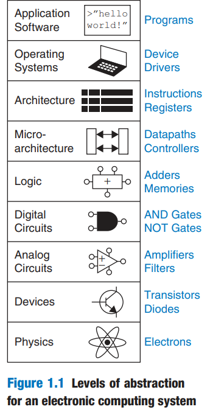



> Good afternoon, folks!

This was the sentence my CG3207 professor, Dr. Rajesh, said at the start of every amazing three-hour lecture every Wednesday at 6 p.m. To be honest, Dr. Rajesh is the best professor I have ever met in ECE. His passion and his depth of knowledge in computer architecture reminded me vividly of the excitement I first felt when studying SC1006 at NTU, where I was also blessed to meet another incredible educator -- Prof. Mohammed M. Sabry Aly.

Without a doubt, I can say that Dr. Rajesh’s enthusiasm, combined with my long-standing love for this field, made CG3207 the most inspiring module I have taken so far at NUS. More than that, this module opened the door to something entirely new in my Year 2 Semester 1 -- a connection that tied my past, present, and future together.

# Amazing Connection

In CG3207, I ported the CoreMark benchmark onto a RISC-V pipelined processor that my teammate and I built from scratch using Verilog HDL on a Nexys4 FPGA. This moment brought me right back to my time in the NTU HPC Team, where I first encountered benchmarking -- but back then, we were benchmarking pre-built CPUs and GPUs.

> This time was different.
> This time, we benchmarked our own processor.

When the benchmark finally produced results through the UART onto my terminal, the excitement I felt was indescribable. It was one of those rare moments where abstract knowledge suddenly became alive.

But CG3207 was not just about computer architecture. It reshaped how I see my entire CEG journey at NUS. Through the eight levels of abstraction from [Harris & Harris’ DDCA](https://wenbo-notes.gitbook.io/ddca-notes/textbook/from-zero-to-one#abstraction), and through Dr. Rajesh’s clear explanations, I suddenly understood how the entire CEG curriculum is carefully structured around this hierarchy of computation. It became the intellectual highlight of my semester.

   

From the physics and device level (CG2027, EE3431C), to analog circuits (EE3408C, EE4407, EE5507), to digital logic (EE2026, EE4415, EE5518), then to microarchitecture and architecture (CG2028, CG3207), followed by operating systems (CG2271), and finally application software (CS1010, CS2113) -- I finally saw the full picture. Step by step, layer by layer, we are being taught how a computer truly works -- from electrons to applications.

It amazed me to realize that what took humanity nearly a century to build, from transistors to VLSI processors to personal computers, is now distilled into our undergraduate education. As I type this on a laptop built upon the very foundations I am learning to understand, I am filled with awe and gratitude.

This bottom-up approach resonates with the concept of First Principles thinking, popularized by Elon Musk. It involves breaking a problem down to its undeniable truths and building up from there. As a CEG student, I am grateful to be taught the fundamental "truths" of the circuit level. I believe this deep knowledge will empower us to solve the massive problems facing our generation -- such as the skyrocketing energy consumption of high-performance computing -- by innovating from the hardware level upward.

This is also what I love to speak about during interviews -- why I chose CEG, and why I choose to work on projects rooted in this discipline and where my passion comes from.

As a CEG undergraduate at NUS, I am deeply grateful for the opportunities I have been given across these semesters. In Year 1 Semester 2, I learned how to approach innovation from a broad perspective. In Year 2 Semester 1, I gained the rigorous technical foundations which are tightly connected that make practical and impactful solutions truly possible. Underlying both of these, however, is the heart of gratitude that was shaped in Year 1 Semester 1 -- a reminder of where these meaningful moments come from, and a call to give back to the One who made them possible. Looking back, I now see clearly how this semester’s highlights are not isolated achievements, but a continuation of the journey that began in my first year.

# Sad moments

Of course, not everything in life flows smoothly. This semester was also the most difficult one I have experienced so far.

## Physical Injury

In mid-September, I fell at a bus stop in NUS. My knees were injured, and worse, I broke a tooth. While the wounds healed, the broken tooth became a permanent mark on my life. Two months later, after long periods of intense work and sitting, I experienced hemorrhoids for the first time.

> These two incidents forced me to stop and reflect deeply.

I realized that my accident with my tooth taught me to let go of vanity. I was not created to look a specific way, but to be a specific way -- correct and true to my purpose. It shifted my focus from my appearance to the One who created me. Furthermore, my other health issues served as a stark reminder: solely focusing on study and work without caring for the body is unsustainable.

## Academic Frustration

In this semester, not every module brought the same joy as CG3207.

In CS2113, teamwork did not go smoothly for me. I truly wanted the team to function well, but things repeatedly fell beyond my control. Looking back now, I realize that this experience taught me something essential:

> how to work with different kinds of people -- even when it is uncomfortable.

In ES2631, I faced my most discouraging academic experience so far. This might also be the first module that I will use my S/U. From the first tutorial, I struggled with group dynamics, nearly carrying the entire first presentation alone -- only to receive a disappointing result. Besides, I tried to apply the creative thinking I learned from DTK1234 and proposed a shared umbrella system on campus, but it was quickly dismissed as "insignificant." But, how the way that "significance" is defined is very subjective and vague from my perspective. Beyond that, there are also a lot of things that make me really feel that this course is teaching me how to write the "eight-legged essay" in ths century of 21st, and even at NUS!

---

Looking back on these difficult moments, I have come to recognize a common thread running through them. Throughout this semester, I placed too much importance on the external aspects of life -- appearance, academic performance, work, and grades. In doing so, I gradually drifted away from what truly matters. I began to lose sight of the deeper purpose of my life: to live with gratitude, and to devote myself to things that are truly eternal -- things that will not fade, decay, or be destroyed by time.

At this point in my journey, seems that I now can see these painful moments from a new perspective. They were not meaningless setbacks, but gentle redirections. Each of them served to shift my focus back to what truly deserves my attention. I now understand more clearly that all external things will eventually pass away; they are impermanent by nature. What I should truly invest my heart and effort in are the things that are eternal.

# Looking Forward

Having said that, this reminds me of a sentence from one of my high school english teachers,

> The end is always good!

I feel that the grace I have experienced never stops, in this semester as well.

## THeart

This semester, I had the opportunity to become a member of a voluntary CCA at Temasek Hall, where we visited a nearby primary school to help the children with their homework. It was truly a deeply meaningful experience for me. I got to know the children personally, guided them through their schoolwork, and even played sports with them after class. Their innocence, energy, and sincerity brought me a kind of joy that is difficult to describe with words.

Although I didn't manage to come to the last session, I was so moved that the kids wrote a lot of notes to my friends! This is so cute and heartwarming!

## SEP and FDDP

As the semester concluded, I received news that exceeded my wildest expectations: I received an offer for the Student Exchange Programme (SEP) at EPFL and an offer for the French Double Degree Program (FDDP) at CentraleSupélec!

This connects the dots of my journey perfectly. Before starting at NUS, I chose to learn French specifically because I dreamed of going to EPFL. I never expected the FDDP opportunity to arise as well. It is a beautiful loop -- experiencing the grace of a decision made years ago coming to fruition now.

---

In all, the countless graces I have experienced this semester -- together with those from my past -- once again remind me of a profound truth: life is always surrounded by grace. At times, things may appear difficult, confusing, or even painful, yet I continue to place my trust in the One who holds my life in His hands. When I choose to surrender every decision to Him, I find a peace unlike any other -- one that no part of this world could ever give.

As this semester comes to an end, I can feel taht I am standing at a point where the road ahead is still unknown. I may not clearly see what is waiting for me, though I can already sense that the coming one or two semesters may be extremely challenging and demanding. Yet despite the uncertainty, I know with conviction that my life is in His hands. To trust, to follow, and to remain faithful -- that is enough.
