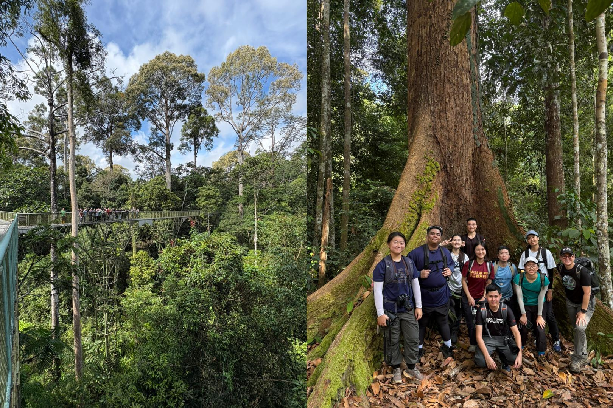
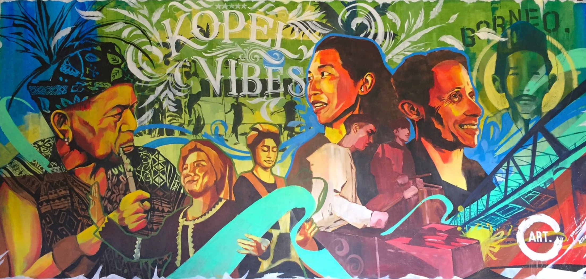



> If you truly love nature , you will find beauty everywhere.
> 
-- Vincent Van Goh

I first came across this quote in Prof. Gretchen's book on butterflies in Borneo, and it stayed with me throughout the Sabah field trip. Looking back, I feel deeply grateful to have enrolled in this legendary GEN course at NUS. It was not only a course about ecological restoration, but also a journey that taught me how to see, feel, and think differently.

In this recap, I would like to begin with nature itself: the birds, elephants, forests, and landscapes that amazed me. Then I will move on to the people I met: the local community, restoration practitioners, professors, classmates, and friends who helped me understand why restoration is not only an ecological process, but also a human one.

To me, this trip was about discovering beauty in nature, but also something more: discovering the resilience, complexity, and inspiration hidden within that beauty.

# Nature

This was my first time entering a real rainforest.

Before the trip, many animals in our textbook were only names and pictures to me. I could recognize them vaguely, but I could not truly connect them with life in the field. After the trip, although I still cannot confidently distinguish every species within the same animal group, I now have a much clearer sense of what they are, where they live, and how they behave. That small change already makes me very happy.

The rainforest was no longer just a concept from geography textbooks or lecture slides. It became something I had walked through, listened to, smelled, touched, and remembered.

## Bird Watching

When I think about nature during the Sabah trip, one of the first memories that comes to mind is bird watching, whether in the early morning or along the Kinabatangan River during the river cruises.

Throughout the trip, I saw many different and beautiful birds, including:

1. Hornbills
2. Kingfishers
3. Many others that I still hope to learn how to identify better

   
  <em style="font-size: 0.9em;">Figure: Birds at Sabah</em>

One of my most memorable experiences was joining an early morning bird-watching session with Prof. Michiel and my friends. Waking up at 4:45 a.m. in Sepilok was definitely crazy HAHA. We even had to take a muddy group photo before entering the Rainforest Discovery Centre, waiting until 6 a.m. before we could go in.

But somehow, that made the memory even more precious. It was not only about the birds we saw, but also about the quiet excitement of waking up before sunrise, the companionship of friends, and the feeling of entering the forest while the day was just beginning.

I still remember someone saying during the trip that bird watching is a wonderful way for people living in cities to reconnect with nature. I found this very meaningful. Maybe one day, I will try bird watching in Shanghai or Singapore. Who knows HAHA.

## Bornean Elephants

As an elephant lover, elephants were the animals I most hoped to see during the Sabah trip.

Before this trip, my memories of elephants came mostly from zoos when I was very young. I had never seen wild elephants before. The only things I knew were quite basic: Asian elephants are generally smaller than African elephants, many Asian elephants have smaller or less visible tusks, and elephants can be dangerous despite looking gentle.

Thankfully, during our first morning river cruise along the Kinabatangan River at KOPEL, I finally saw them.

  <video width="250" controls>
    <source src="../images/posts/NUS-GEN2007/elephants.mp4" type="video/mp4">
  </video>

Seeing elephants in the wild felt completely different from seeing them in a zoo. They were not simply "animals on display." They belonged to the landscape. They were part of the river, the forest edge, the morning mist, and the larger ecosystem around them. That moment reminded me that conservation is not about protecting isolated species only; it is about protecting the living systems that allow them to exist freely.

## Rainforest

For the whole semester, I had been dreaming of experiencing the rainforest in person. The highlight for the rainforest part was definitely the 11 km hike on the third day of our Sabah trip. During the hike, I finally saw buttress roots and huge tropical trees that I had only seen before in my high school geography textbook.

   
  <em style="font-size: 0.9em;">Figure: Hike through the rainforest at Sabah</em>

During the hike, I was walking through the evolution of landscapes: from tropical rainforest, to swamp forest, to mangroves, and finally towards the river. What impressed me even more was Prof. Michiel's explanation of tree growth in the rainforest. In order to compete for sunlight, trees must grow as fast and as straight as possible. This is why many rainforest trees appear so tall and vertical. Meanwhile, buttress roots help stabilize these enormous trees in shallow tropical soils.

For me, this explanation was eye-opening. I have always enjoyed scientific reasoning behind geographical phenomena, but during this hike, the reasoning was no longer abstract. I could see it directly in front of me. The forest became a living textbook, and every tree seemed to carry its own logic.

# People

After reflecting on the beauty of nature itself, I want to move on to the people I met during this trip.

From APE Malaysia to KOPEL, from professors and TAs to classmates and local residents, I met many people who helped me understand restoration from different perspectives. I am truly grateful for these encounters because they taught me that restoration is never only about planting trees. It is also about people, communities, knowledge, patience, and long-term commitment.

## APE Malaysia

I met Mark and Muz from APE Malaysia at Sakau. Their sharing helped me connect many of my thoughts during the trip and understand more deeply why restoration is necessary.

### The Problem

APE Malaysia began their introduction by explaining the problem they are facing. This problem is also at the heart of GEN2007: why do we need restoration?

The answer is simple but painful: nature has been damaged by humans.

Along the Kinabatangan River, large-scale logging took place from the 1970s to the 1990s, and the area was not fully protected until around 2006. In addition to logging, the expansion of agricultural land, especially oil palm plantations, accelerated deforestation and fragmented the rainforest along the river.

This helped me connect the situation with my own thinking about equilibrium.

In nature, I believe there exists a kind of equilibrium. As long as the external disturbance remains within a certain threshold, the ecosystem may be able to recover and return to its original state by itself. This, to me, is closely related to the idea of resilience, which I would like to define as follows:

> The resilience of nature is the maximum external disturbance that an ecosystem can absorb while still being able to return to its equilibrium state.

However, what humans have done in the past was equivalent to applying too much external force to the natural system. Once that force exceeds the threshold, the ecosystem may no longer be able to recover on its own. At that point, nature needs help.

This is why restoration matters.

As Mark explained, if we do nothing, some logged areas may have little chance of returning to forest again. Restoration, therefore, is not about replacing nature's work. It is about helping nature regain the conditions it needs to recover.

### Our Job

> So pretty much what we are doing is to recreate back an environment where the forest can eventually thrive and can eventually regrow back on its own.
> 
-- Mark from APE Malaysia

According to Mark, restoration is about kick-starting the process of natural regeneration.

I find this idea very powerful. It suggests that human intervention should not dominate nature, but support it. We are not the main designers of the forest. Instead, we help recreate the initial conditions so that the forest can eventually take over and grow by itself.

During one evening reflection with my classmates, I was thinking about whether people or nature are more important in restoration. I think for now, my answer will change to: both are important.

People are important because the restoration process needs to be started, monitored, protected, and sustained. Nature is important because the ecosystem itself is incredibly complex, and only nature can eventually rebuild the full web of interactions that makes a forest alive.

In other words, humans may help light the spark, but nature carries the fire forward.

### Connecting Restoration with Field Monitoring

During the Sabah trip, my group worked on monitoring the restoration process. We measured tree canopy cover, soil conditions, and other ecological indicators.

At first, field monitoring might seem like a technical task: collecting data, recording numbers, and analyzing results. But after listening to Mark, I realized that our work had a deeper purpose. The data we collected could help APE Malaysia choose suitable tree species for restored sites and better understand how to recreate an environment where the forest can recover.

This made me feel that our fieldwork, although small, was connected to the larger goal of restoration. We were not simply collecting data for an assignment. We were contributing, even in a tiny way, to the process of helping nature regenerate.

## KOPEL

The next group of people I want to reflect on is KOPEL. During the week we spent with them, I came to understand another crucial dimension of resilient restoration: the local community.

What moved me most was seeing three generations of local people involved in restoration work, from Uncle Arbu, to Azmann, to Haikal, who is only one year younger than me. Their commitment was truly amazing. Seeing people from different generations dedicating their time and energy to restoration made me realize that ecological resilience also depends on social resilience.

   
  <em style="font-size: 0.9em;">Figure: KOPEL Vibes</em>

A restored forest cannot survive through short-term effort alone. It needs people who stay, people who care, and people who continue the work after outsiders leave.

As Prof. Gretchen pointed out in her paper, supporting the local community is essential, whether through fieldwork or ecotourism. For people like us, it is impossible to spend our entire lives in the forest doing restoration. One day, we will leave. What really matters is whether we have helped build a system that can continue without us.

This is why training and empowering the local community is so important. Once local people have the knowledge, skills, and ownership to carry out restoration systematically, they become the long-term guardians of the landscape.

This also aligns with the purpose of the GEN module at NUS: we are meant to help a community. In GEN2007, this meaning becomes even richer. We are not only helping a human community, but also helping the community of life within nature.

## Other Friendly People

Besides the local community, I am also deeply grateful for the many friendly people I met during the trip.

First of all, I want to thank Prof. Gretchen, who is one of the kindest professors I have met at NUS. Her passion, patience, and encouragement made this course feel truly special.

I also want to thank my fellow students and TAs. After sharing my reflections, I often received thoughtful feedback from my friends, which helped me see things from perspectives I had never considered before. As one of the only two engineering students in this course, I felt very lucky to meet so many people from Geography, BES, Architecture, and other backgrounds. I really enjoyed thinking and discussing with people whose academic background is very different from mine.

Lastly, I want to thank the American auntie I met at Sepilok. She was part of the group from Case Western Reserve University in Cleveland, USA. Her belief that there is an equilibrium in nature helped shape my own reflection on resilience and restoration.

It feels a little sad to know that I may not meet many of these people again. But perhaps that is also part of life. Some people appear briefly, yet leave lasting traces in our thoughts. This reminds me to cherish the time I spend with the people I meet.

Hopefully, we will meet again somewhere in the future. Who knows where HAHA!

# A Special Inspiration

Before wrapping up, I want to reflect on a special inspiration I gained from the Sabah trip.

Building on the reflections above, I have discussed two important aspects that make restoration resilient: the regeneration capacity of nature and the long-term involvement of people. But during the trip, I also noticed something else that deeply inspired me as an engineering student.

Nature solves problems in a very different way from how we often solve problems in engineering.

In engineering, we usually use a divide-and-conquer approach. We break a large problem into smaller parts, solve each part individually, and then combine the solutions. This makes complex problems easier to manage. However, the trade-off is that the final result may not always be globally optimized. One good example is the [routing](https://wenbo-notes.gitbook.io/ee4415-notes/part-1-lec-digital-design-flow/lec-3a-digital-design-flow#routing) problem in the field of ASIC or chip design.

Nature, however, seems to solve many problems together.

In a forest, tree growth, soil conditions, sunlight competition, water movement, biodiversity, seed dispersal, and animal behavior are all connected. The system does not optimize each problem separately. Instead, it evolves as an integrated whole. This makes nature incredibly complex, but also incredibly elegant.

As Mark said, restoration is about recreating an environment where the forest can thrive and eventually regrow on its own. This environment is mainly built through trees, and our field monitoring work helps identify suitable species to plant in restored sites.

This led me to think about my own field: ASIC or chip design.

In chip design, is there also such an "environment" that we can recreate, so that once the right conditions are established, the whole design system can move toward a more globally optimized solution? If such an environment exists, perhaps we can reduce the amount of manual effort, computational cost, and ultimately energy consumption required in the design process.

This connection between rainforest restoration and chip design may seem unexpected, but it is exactly what made the trip so inspiring to me. Nature did not only show me beauty. It also gave me a new way of thinking about optimization, systems, and design.

Therefore, at this point, I would like to slightly modify Vincent Van Goh's quote:

> If you truly love nature, you will find beauty and inspiration everywhere.

# Epilogue

To wrap up this recap, I feel truly grateful to have joined this amazing course with such friendly classmates, TAs, professors, and local partners. I still remember what Prof. Gretchen told me during my interview:

> Many people will think this Sabah trip is a once-in-a-life experience. But if you think about it in another way, this might be the starting point of a new hobby, and you can continue to document things as an ecologist wherever you go.

This sentence impressed me deeply.

Now, I feel that geography, and more specifically resilient restoration, has indeed become one of my new interests. This trip may have been short, but it opened a new door for me. It made me want to observe more, document more, and understand more about the natural world around me.

During the trip, one of my classmates and I also talked about how everything is connected. Observations from nature, concepts from this course, ideas from engineering, conversations with people, and even personal reflections all seemed to come together.

I do not think this is a coincidence.

Instead, it makes me believe more strongly that the world is full of hidden connections waiting to be discovered. The more we observe, the more we realize that nature is not separate from us. It teaches us how to think, how to live, how to restore, and how to be grateful.

This trip helped me find beauty in nature, inspiration in restoration, and connections across different parts of my life.

And for that, I am deeply thankful.

  May 31st 2026, Shanghai, China

