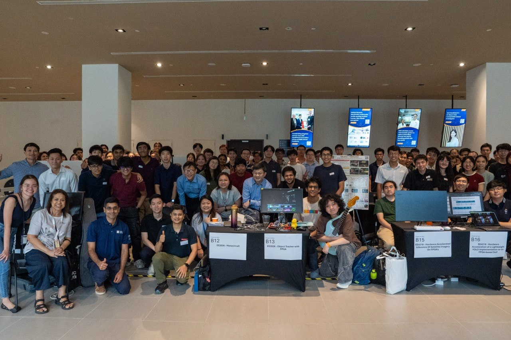
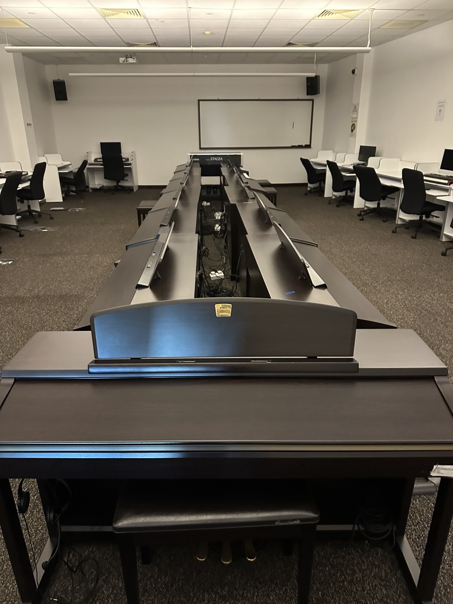
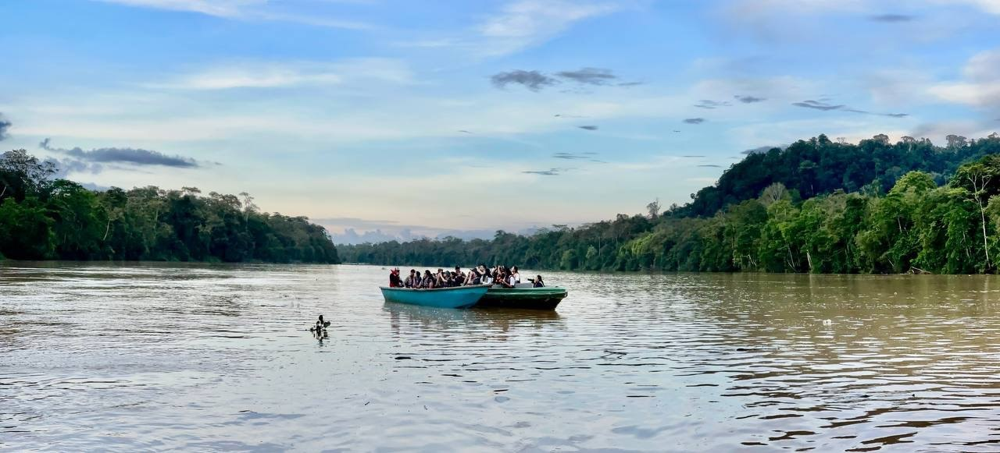



> We need more people like you!

This was what a principal research engineer from DSO, Singapore, told our group after I presented two of my projects with my teammates at the NUS ExCEllence 2026 project showcase. Now one of my group members is working at DSO, and the other is working at a famous international chip design company. And thankfully, I also manage to find something to do during this summer break.

Later, the same pricipal research engineert from DSO asked me another question:

> Where do you learn all this from ?

I think this question came from the way our project connected ideas from several different fields and turned them into something coherent and, in his words, impressive. But beyond the project itself, the question pushed me to think about something more personal: where did I really learn everything I learned this semester? Was it from lectures? Textbooks? Projects? Conversations? Teamwork? Or from the many moments when different ideas, originally belonging to different courses or even different disciplines, suddenly clicked together?

This question also shaped the way I want to structure this recap. Instead of simply listing what I did in Year 2 Sem 2, I want to write about the different "teachers" I encountered along the way. Some of them were professors. Some were courses. Some were projects. Some were teammates. Some were books. And most importantly, the biggest teacher in my life is HIM!

# Teachers From ECE

This semester, I had the chance to take two truly amazing courses from NUS ECE: EE4218 Embedded Hardware System Design and EE4415 Integrated Digital Design. Together with CG3207, which I took last semester, these courses formed a very meaningful full circle moment for me. As Prof. Rajesh once told me during a post-lecture Q&A, there are deep connections among these three courses, even though each of them looks at hardware systems from a different angle. CG3207 taught me to think in terms of processors and instructions. EE4218 shifted my attention to embedded hardware systems and AI accelerators design. EE4415 then brought me deeper into integrated digital design, showing how high-level RTL design decisions can be shaped and optimized for power, performance, and area, while also giving us a glimpse into the lower-level transistor circuit design beneath those abstractions.

What made these courses even more special was not only the content, but also the professors behind them. I feel very grateful that I had many opportunities to speak with Prof. Rajesh, Prof. Massimo, and Prof. Kelvin after lectures. Those conversations were sometimes short, sometimes technical, sometimes philosophical, but they all left a mark on the way I think about hardware, research, and learning.

## EE4218

EE4218 was taught by Prof. Rajesh, the same professor who taught me CG3207 last semester. To me, Prof. Rajesh is one of the kindest and most patient professors I have met at NUS. I still remember many post-lecture Q&A sessions where he carefully answered all kinds of questions from me and my fellow classmates, ranging from course content to textbook recommendations to broader industry trends in hardware design. What I really appreciate about him is his ability to explain complex concepts clearly and calmly. Topics such as clock domain crossing (CDC), which can easily feel abstract and intimidating, became much more understandable through his explanations.

More importantly, one sentence from Prof. Rajesh revealed the deep connection between CG3207 and EE4218. He told us that in CG3207, we think in terms of instructions -- we fetch, decode, and execute them to manipulate data. In EE4218, however, the focus shifts to the data itself: we fetch and process data directly, without relying on the instruction-decoding abstraction of a CPU. I would say honestly this is one of the inspirations for our VNN project in EE4218! (Will see later!)

## EE4415

EE4415 was another course that deeply influenced me this semester. It was taught by two professors, Prof. Massimo and Prof. Kelvin, both of whom shaped my thinking in very different but equally meaningful ways.

### Prof. Massimo

When talking about Prof. Massimo, I think there is no doubt that he is one of the most respected professors in digital design at NUS ECE. His research experience and achievements in chip design are extremely impressive, and this also made his lectures feel very different. They were not just about teaching textbook knowledge; they carried the weight of decades of real research experience (he told us that some techniques that are covered in EE4415 actually come from his Green-IC group)!

At the same time, Prof. Massimo was probably also the busiest professor I have ever met. It was not always easy to find time to talk to him. I still remember one midterm review Q&A session where the EE2026 and EE4415 Q&A sessions were combined, and he also had meetings with people from industry. What was originally supposed to be a one-hour session eventually became around three hours. Oof, but this also taught me something HAHA. Because time with him was limited, I had to think much more carefully about what questions were truly worth asking. I had to refine my questions, identify what I really did not understand, and make the limited discussion time count.

Among the questions I asked him, one answer inspired me a lot. At that time, I was thinking about a system where the loop bound became the bottleneck (at that time, I had not yet learned time interleaving, which can be understood as trading register area for better performance and thus can be a solutoin to loop bound problem). I asked Prof. Massimo how we might solve this kind of bottleneck. Instead of answering only from the perspective of digital circuit design, he pointed me to loop unrolling, a mature technique from compiler design. In essence, loop unrolling also trades area for performance.

This idea resonated strongly with me. It also reminded me of something Prof. Massimo said during the very first lecture of EE4415. At the beginning of the course, he asked how many of us still read books, whether physical books or PDFs. I still remember that only a handful of people raised their hands. As someone who has loved reading textbooks since entering university, and who also enjoyed reading famous books even before university, I strongly agreed with him. In an age where information is fragmented, fast, and increasingly mediated by AI, there is still something irreplaceable about slowing down and reading a classic textbook carefully. A good textbook does not only give answers. It builds a structure in my mind. It teaches me how experts in a field organize ideas, define abstractions, and reason from first principles.

These inspirations from Prof. Massimo, together with Prof. Rajesh's distinction between instruction-centric and data-centric thinking, became deeply connected in my mind. They helped me lead our team to develop VNN (Verilog Neural Network), a high-performance and energy-efficient RTL framework for writing a CNN accelerator. To me, VNN was not just a course project. It was a concrete embodiment of many ideas I had encountered across CG3207, EE4218, EE4415 and the classic textbooks on computer architecture I have read.

   
  <em style="font-size: 0.9em;">Figure: NUS ExCEllence Project Showcase</em>

This experience also shaped my current research interests. I increasingly believe that many breakthroughs happen at the intersection of fields, where elegant techniques or design principles from one domain can be adapted to solve problems in another. This is why I want to keep connecting ideas across electronics, computer science, mathematics, physics, geography, and even music. I do not want my learning to be limited by the boundaries of one department or one discipline. So, I am thinking, why not try at least one meaningful, high-quality course from each faculty at NUS during my undergraduate study here?

### Prof. Kelvin

The second half of EE4415 was taught by Prof. Kelvin, another very kind and inspiring professor from NUS ECE. From his lectures, I could really feel his strength in transistor-level digital circuit design. I still remember him mentioning several times about his experience at AMD in the US, especially how AMD pushed CPU performance through careful design-side optimization. One point that impressed me was his discussion of how AMD can fuse "something" to optimize netlists across the boundaries created during the initial system partitioning of a design.

The most memorable conversation I had with Prof. Kelvin was near the end of the semester, when several CEG students and I discussed the usage of AI tools in ASIC design with him. I am not entirely sure whether my understanding is fully correct, but what I took away from the conversation was this: for AI to truly help us in engineering design, it must understand the "language" we use to communicate our intentions.

This "language" does not only mean English or any spoken language. In ASIC design, language can refer to Verilog, timing constraints, circuit schematics, microarchitectural diagrams, EDA tool commands, design abstractions, and even the implicit conventions that designers use when they think about circuits. One powerful point Prof. Kelvin mentioned was that AI tools may sometimes find connections or possibilities that humans overlook. To me, this suggests that the future of AI in chip design depends not only on making models more powerful, but also on allowing them to communicate more accurately with the design process itself.

This made me think about modern EDA tools such as Cadence, whose learning curve can feel extremely steep (personally speaking). Perhaps in the future, AI agents will be able to operate these tools on our laptops with high precision. We may only need to give a high-level command, and as long as the agent understands how to "communicate" with the software and the design environment, it can carry out the required steps accurately. One reason Prof. Kelvin mentioned for exploring this direction is that AI may sometimes notice details or connections in a design that human designers might overlook, and these overlooked points could potentially lead to better power, performance, and area trade-offs.

But this also raises a deeper question: if we want to let AI tools help us in the ASIC design, how should we communicate our microarchitectural thoughts to AI agents clearly? If future chip design involves collaboration between humans and AI, then we may need better abstractions for describing circuits. These abstractions should be expressive enough for humans to reason with, and structured enough for AI agents to understand then manipulate. I think such ideas may already exist in some form. For example, from Giovanni's textbook, I have seen how powerful abstractions can guide circuit design. Perhaps one research direction for next-generation AI agents in chip design is to study how these abstractions can become a shared language between human designers, EDA tools, and AI systems.

At the end of this section, I also want to return to something Prof. Massimo said about AI. I remember hearing him tell another student that, as NUS students, we should learn how to use AI wisely to boost the efficiecny of our work. From what I heard, Prof. Massimo uses AI mainly to quickly understand knowledge from fields he is less familiar with, such as semiconductor materials. However, he strongly encouraged us not to use AI to replace the thinking process itself. For certain questions, we must still derive the whole process by ourselves at least once, so that we truly understand what is going on.

I think this is especially important now, when AI is developing so quickly that nobody can be completely sure how it will reshape our future work. But one thing I still remember clearly is Prof. Massimo's message from the beginning of EE4415: *keep learning*. I strongly agree with him. To me, continuous learning is not only a way to do better research, but also a way to remain intellectually alive. It is one way how we can avoid being outperformed by AI, not by competing with it on memorization or speed, but by deepening our ability to think, connect, question, and create.

# Teachers Beyond ECE

Besides the professors and people I met from ECE, I also feel very grateful that I managed to take several meaningful and interesting courses from other faculties at NUS in this semester. Through these courses, I met professors and classmates whose ways of thinking were very different from mine. That difference itself became a source of learning. It reminded me that university is not only a place to go deeper into one's own field, but also a place to step outside familiar boundaries and encounter completely different ways of seeing the world.

## CDE2501

CDE2501 is a common course for every CDE student, and what I really liked about it was how it gave me a chance to explore Singapore with my group members. For our group project, we explored Tampines and studied how cycling culture and cyclability could be improved there.

Beyond the experience of travelling around Singapore, what amazed me most was learning how a city like Singapore is developed to be more livable and sustainable. Although I am not an urban designer, it was very eye-opening to see urban development as a complex system, where transportation, housing, greenery, public spaces, policy, and human behaviour are all deeply connected.

I was also very inspired by one of my group members, who was really good at systems thinking. From working with him, I began to see how powerful it is to understand a problem not as a single isolated issue, but as something embedded inside a larger network of relationships. This experience later helped me in GEN2007 as well, where I found myself trying to observe nature, people, and restoration work in a more systematic way.

## GEC1023

To be honest, before this semester, I did not expect that I would have the chance to experience studying at YSTCM at NUS. And to be honest, it became one of the most refreshing parts of my semester. Prof. Koo is extremely passionate and very good at playing the piano. I still remember being able to listen to beautiful piano melodies during lectures every week. It felt very different from my usual engineering courses!

   
  <em style="font-size: 0.9em;">Figure: Pianos that I use at YSTCM </em>

What made the course even more meaningful was that I could actually play simple melodies using what I had learned. That feeling was surprisingly joyful. I also experienced a small "Eureka" moment near the start of the semester. When I was taught different major scales -- C major, D major, E major, and so on -- I suddenly realized that all of them can be used to play do, re, mi, fa, sol, and so on. They may sound different because they start from different notes, but structurally, they are still expressing the similar sound. This realization helped me play songs that I used to play more naturally than before. It felt like something that had once been mysterious suddenly became understandable. That moment was really amazing!

Another very special part of this course was the opportunity to attend piano masterclasses conducted by well-known pianists at YSTCM. I still remember attending Prof. An's masterclass, where I learned a lot from the way he understood piano performance. Initially, I thought the piano could provide me with a way to connect with people across time and space, and to experience different cultures through the songs I played. After the masterclass, I gained a deeper understanding of performance itself.

One idea from Prof. An that stayed with me was that performing a piano piece should be treated as a journey. Along this journey, we need to relook, rethink, and research the piece again and again, asking what can be done better. Only after this process can we play better and truly enjoy the performance itself.

Prof. An also talked about the role of art in our lives. I agree with him deeply that piano is a form of art because it allows multiple interpretations from different individuals. A single piece of music can carry different meanings for different people, and each person can form a personal connection with it. That is what makes art powerful! It does not force everyone to feel the same thing. Instead, it gives each person space to discover their own meaning.

Prof. An ended his masterclass with a quote that I still remember:

> Make art part of your life!

I think this course was a beautiful beginning for a "new" hobby. I really hope to keep learning piano and continue finding inspiration from the world of music!

## GEN2007

GEN2007 was the first course I have ever taken from the Geography department at NUS, and it was truly one of the most amazing courses I have ever taken so far. I have already written a separate [blog](./2026-05-31-NUS-GEN2007.md) to recap my experience in GEN2007, but I still want to mention it here because it became such an important part of my semester.

   
  <em style="font-size: 0.9em;">Figure: River Cruise at Sabah</em>

Overall, I feel very grateful that I had the chance to immerse myself in the rainforest and meet so many people who care deeply about restoration. I will never forget the night hike, the 11 km hike through the rainforest, tree planting, river cruising, cultural night, and many other amazing moments spent with my profs and friends. These were not only activities on a course itinerary. They were moments where I could slow down, observe carefully, and experience a world very different from the one I usually live in.

What made the course even more meaningful was not only what I saw, but also what I learned from the people around me. I gained inspiration from my observations, from the conversations I had, and from reading the field notebooks written by my classmates. Everyone noticed different things. Everyone cared about different details. Through their writing, I felt as if I was seeing the same forest through many different pairs of eyes. This made me even more willing to meet people from different backgrounds and learn from how they observe and understand the world.

During the interview for this course, Prof. Gretchen said something that has stayed with me until now. She reminded me that this field course did not have to be a once-in-a-lifetime experience. Instead, I could treat it as the beginning of a new hobby: documenting like an ecologist wherever I go in the future. I really hope to carry this mindset with me: to observe carefully, to document faithfully, and to find inspiration and connection from nature, no matter where I am.

# Epilogue

After this semester, I think I can finally answer the question I raised at the beginning of this recap:

> Teachers are everywhere!

I still remember one testimony I experienced near the start of GEC1023. At that time, I felt a little afraid and not very confident because I barely had any knowledge of playing the piano. But I strongly remember that HE gave me a thought: I was learning piano simply to praise HIM and I want to teach my siblings about what I have learned. After this idea came to me, it felt as if my eyes were suddenly opened. Magically and thankfully, when I carried this thought with me throughout the course, learning piano became much more joyful and meaningful.

This experience also reminded me of the other courses and skills I have taken, am taking, or will take in the future. Sometimes, I do not know whether a course will be useful. Sometimes, I do not immediately understand why I am learning a certain skill or encountering a certain experience. But again and again, I have seen that what I learn eventually becomes connected in ways I could not have predicted. The key is to trust.

Looking back on the past few semesters, I increasingly feel that all the courses I have taken were useful in their own ways. Some trained my technical ability. Some shaped my way of thinking. Some opened my eyes to other disciplines. Some taught me to observe the world more carefully. Some helped me discover beauty. And all of them reminded me of HIM.

Teachers are everywhere. And this also means that HIS grace is everywhere. As I once discussed with another student from GEN2007, I deeply feel that everything is connected, and that all things work together for the good of those who love HIM. So, what I need to do is to keep learning, keep observing, keep giving thanks, and always trust.

  Jun 25th 2026, Shanghai, China

